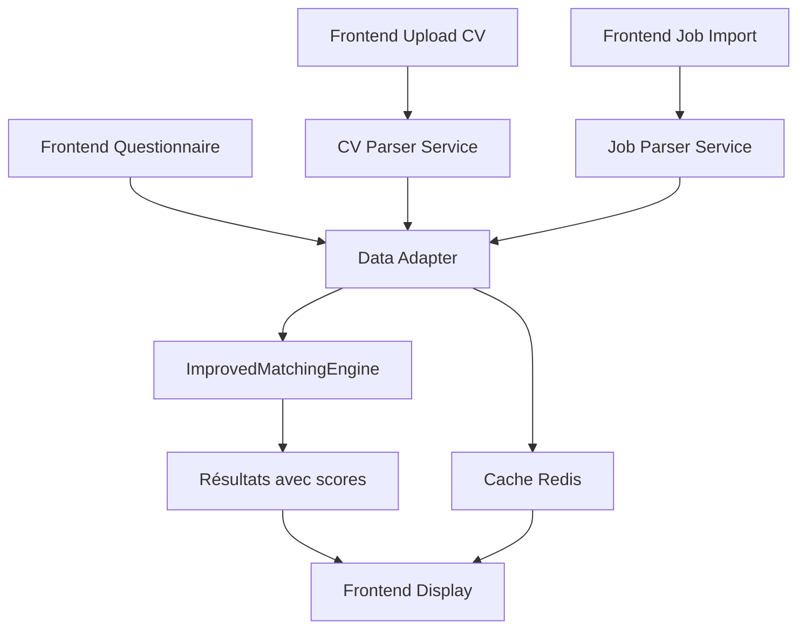

# 📋 Guide d'intégration Commitment- Data Adapter

## 🎯 Vue d'ensemble

Ce guide vous explique comment intégrer l'adaptateur de données avec votre système de parsing CV/Job et votre moteur de matching `ImprovedMatchingEngine`.

## 📁 Structure des fichiers

```
data-adapter/
├── data_adapter.py          # ✨ Adaptateur principal (NOUVEAU)
├── api_matching.py          # ✨ API FastAPI (NOUVEAU) 
├── test_integration.py      # ✨ Tests d'intégration (NOUVEAU)
├── smartmatch_data_adapter.py  # Adaptateur existant
├── flask_api.py            # API Flask existante
├── requirements.txt        # Dépendances
└── Dockerfile             # Configuration Docker
```

## 🔧 Installation et configuration

### 1. Installation des dépendances

```bash
# Depuis le dossier data-adapter/
pip install -r requirements.txt

# Dépendances supplémentaires pour la nouvelle API
pip install fastapi uvicorn pydantic
```

### 2. Variables d'environnement

Créez un fichier `.env` dans le dossier `data-adapter/` :

```env
# Configuration API
API_HOST=0.0.0.0
API_PORT=8000
API_WORKERS=4

# Configuration logging
LOG_LEVEL=INFO
LOG_FILE=/app/logs/matching.log

# Configuration cache (optionnel)
REDIS_URL=redis://localhost:6379
CACHE_TTL=3600

# Configuration moteur de matching
GOOGLE_MAPS_API_KEY=your_google_maps_api_key
```

### 3. Mise à jour du Dockerfile

Ajoutez au `Dockerfile` existant :

```dockerfile
# Copier les nouveaux fichiers
COPY data_adapter.py /app/
COPY api_matching.py /app/
COPY test_integration.py /app/

# Installer FastAPI
RUN pip install fastapi uvicorn pydantic

# Exposer le port pour l'API
EXPOSE 8000

# Point d'entrée pour l'API FastAPI
CMD ["uvicorn", "api_matching:app", "--host", "0.0.0.0", "--port", "8000"]
```

## 🚀 Démarrage rapide

### 1. Test de l'adaptateur

```bash
# Test basique de l'adaptateur
cd data-adapter/
python test_integration.py
```

### 2. Démarrage de l'API FastAPI

```bash
# Développement
uvicorn api_matching:app --reload --host 0.0.0.0 --port 8000

# Production
uvicorn api_matching:app --host 0.0.0.0 --port 8000 --workers 4
```

### 3. Test de l'API

```bash
# Test de santé
curl http://localhost:8000/health

# Test de matching complet
curl -X POST http://localhost:8000/api/matching/complete \
  -H "Content-Type: application/json" \
  -d @examples/complete_request.json
```

## 📊 Intégration avec votre frontend

### 1. Formats JSON attendus

Votre frontend doit envoyer les données dans ces formats :

#### CV Data
```json
{
  "nom": "Dupont",
  "prenom": "Marie",
  "email": "marie.dupont@email.com",
  "competences": ["Python", "JavaScript", "React"],
  "experience": "5 ans d'expérience"
}
```

#### Questionnaire Data
```json
{
  "adresse": "Paris",
  "temps_trajet_max": 45,
  "fourchette_salaire": "55k-65k",
  "types_contrat": ["CDI"]
}
```

#### Jobs Data
```json
[
  {
    "id": "job_001",
    "titre": "Développeur Full Stack",
    "entreprise": "TechCorp",
    "competences": ["Python", "React"],
    "salaire": "60k"
  }
]
```

### 2. Endpoints disponibles

| Endpoint | Méthode | Description |
|----------|---------|-------------|
| `/health` | GET | Vérification de l'état du service |
| `/api/matching/complete` | POST | Matching complet CV + Jobs |
| `/api/matching/single` | POST | Matching CV vs 1 job |
| `/api/matching/batch` | POST | Matching multiple candidats |
| `/api/data/validate` | POST | Validation des données |

### 3. Exemple d'intégration JavaScript

```javascript
// Fonction pour lancer un matching complet
async function runMatching(cvData, questionnaireData, jobsData) {
  try {
    const response = await fetch('/api/matching/complete', {
      method: 'POST',
      headers: {
        'Content-Type': 'application/json'
      },
      body: JSON.stringify({
        cv_data: cvData,
        questionnaire_data: questionnaireData,
        jobs_data: jobsData,
        options: {
          limit: 10,
          min_score: 40
        }
      })
    });
    
    const result = await response.json();
    
    if (result.success) {
      console.log(`${result.count} résultats trouvés`);
      return result.results;
    } else {
      console.error('Erreur:', result.error.message);
      return [];
    }
  } catch (error) {
    console.error('Erreur réseau:', error);
    return [];
  }
}

// Utilisation
const matches = await runMatching(
  parsedCvData,
  questionnaireData, 
  parsedJobsData
);
```

## 🔌 Intégration Docker

### 1. Ajout au docker-compose.yml

```yaml
services:
  # ... vos services existants ...
  
  matching-api:
    build:
      context: ./data-adapter
      dockerfile: Dockerfile
    ports:
      - "8000:8000"
    environment:
      - API_HOST=0.0.0.0
      - API_PORT=8000
      - LOG_LEVEL=INFO
    volumes:
      - ./logs:/app/logs
    depends_on:
      - cv-parser-service
      - job-parser-service
    networks:
      - commitment-network
    restart: unless-stopped
```

### 2. Variables d'environnement Docker

```yaml
environment:
  - DATABASE_URL=postgresql://user:pass@db:5432/commitment
  - REDIS_URL=redis://redis:6379
  - GOOGLE_MAPS_API_KEY=${GOOGLE_MAPS_API_KEY}
```

## 🧪 Tests et validation

### 1. Tests automatisés

```bash
# Tests d'intégration complets
python test_integration.py

# Tests unitaires
python -m pytest tests/ -v

# Tests de charge
python -m pytest tests/test_performance.py
```

### 2. Validation des données

L'API inclut un endpoint de validation :

```bash
curl -X POST http://localhost:8000/api/data/validate \
  -H "Content-Type: application/json" \
  -d '{
    "cv_data": {"competences": ["Python"]},
    "job_data": {"titre": "Dev", "competences": ["Python"]}
  }'
```

## 📈 Monitoring et logs

### 1. Métriques disponibles

- Nombre de requêtes par minute
- Temps de traitement moyen
- Taux d'erreur
- Utilisation mémoire

### 2. Logs structurés

```python
# Les logs incluent automatiquement :
{
  "timestamp": "2025-05-26T14:30:00Z",
  "level": "INFO",
  "request_id": "uuid-123",
  "processing_time": 1.23,
  "results_count": 5
}
```

### 3. Healthcheck Docker

```yaml
healthcheck:
  test: ["CMD", "curl", "-f", "http://localhost:8000/health"]
  interval: 30s
  timeout: 10s
  retries: 3
```

## 🔄 Flux de données complet



## ⚡ Optimisations de performance

### 1. Cache Redis

```python
# Configuration Redis pour la production
REDIS_CONFIG = {
    'host': 'redis',
    'port': 6379, 
    'db': 0,
    'decode_responses': True,
    'socket_keepalive': True,
    'socket_keepalive_options': {},
    'health_check_interval': 30
}
```

### 2. Limitation de débit

```python
# Dans api_matching.py - ajouter slowapi
from slowapi import Limiter, _rate_limit_exceeded_handler
from slowapi.util import get_remote_address

limiter = Limiter(key_func=get_remote_address)
app.state.limiter = limiter

# Limitation à 60 requêtes/minute
@app.post("/api/matching/complete")
@limiter.limit("60/minute")
async def complete_matching(request: Request, ...):
```

### 3. Pagination et streaming

```python
# Pour de gros volumes de données
@app.post("/api/matching/stream")
async def stream_matching(...):
    async def generate_results():
        for batch in process_in_batches(jobs_data, batch_size=10):
            results = adapter.run_matching(cv_data, questionnaire_data, batch)
            yield json.dumps(results) + "\n"
    
    return StreamingResponse(generate_results(), media_type="text/plain")
```

## 🚨 Gestion d'erreurs

### 1. Codes d'erreur standard

| Code | Description |
|------|-------------|
| `MISSING_CV_DATA` | Données CV manquantes |
| `INVALID_SKILLS_FORMAT` | Format compétences invalide |
| `MATCHING_ENGINE_ERROR` | Erreur moteur de matching |
| `PROCESSING_ERROR` | Erreur générique de traitement |

### 2. Retry automatique côté frontend

```javascript
async function matchingWithRetry(data, maxRetries = 3) {
  for (let i = 0; i < maxRetries; i++) {
    try {
      return await runMatching(data);
    } catch (error) {
      if (i === maxRetries - 1) throw error;
      await new Promise(resolve => setTimeout(resolve, 1000 * Math.pow(2, i)));
    }
  }
}
```

## 🔒 Sécurité

### 1. Authentication (optionnel)

```python
# Ajouter à api_matching.py
from fastapi.security import HTTPBearer, HTTPAuthorizationCredentials

security = HTTPBearer()

async def verify_token(credentials: HTTPAuthorizationCredentials = Depends(security)):
    # Vérification du token JWT
    if not verify_jwt(credentials.credentials):
        raise HTTPException(status_code=401, detail="Token invalide")
```

### 2. CORS sécurisé

```python
# Configuration CORS pour production
app.add_middleware(
    CORSMiddleware,
    allow_origins=["https://votre-frontend.com"],  # Spécifier votre domaine
    allow_credentials=True,
    allow_methods=["POST", "GET"],
    allow_headers=["*"],
)
```

## 📞 Support et dépannage

### 1. Problèmes courants

#### Erreur "my_matching_engine not found"
```bash
# Vérifier que le fichier est dans le bon répertoire
ls -la my_matching_engine.py

# Installer les dépendances manquantes
pip install -r requirements.txt
```

#### Erreur de format de données
```python
# Valider les données avant envoi
python -c "
from data_adapter import CommitmentDataAdapter
adapter = CommitmentDataAdapter()
print(adapter.normalize_skills(['Python', 'JavaScript']))
"
```

#### Performance lente
```bash
# Vérifier les logs de performance
tail -f logs/matching.log | grep processing_time

# Monitorer l'utilisation mémoire
docker stats matching-api
```

### 2. Debug mode

```python
# Activer le mode debug
import logging
logging.getLogger('data_adapter').setLevel(logging.DEBUG)

# Ou via variable d'environnement
export LOG_LEVEL=DEBUG
```

## 🎯 Prochaines étapes recommandées

1. **Tests en production** : Déployez d'abord sur un environnement de staging
2. **Monitoring avancé** : Intégrez Prometheus/Grafana pour le monitoring
3. **Cache Redis** : Remplacez le cache en mémoire par Redis pour la scalabilité
4. **Load balancing** : Configurez un load balancer pour plusieurs instances
5. **CI/CD** : Ajoutez les tests à votre pipeline de déploiement

## 📧 Contacts

Pour toute question sur l'intégration :
- 📊 **Monitoring** : Vérifiez `/health` et `/status`
- 🔍 **Debug** : Activez `LOG_LEVEL=DEBUG`
- 📝 **Documentation** : Consultez `/docs` pour l'API interactive

---

**🚀 Votre système de matching est maintenant prêt pour la production !**
