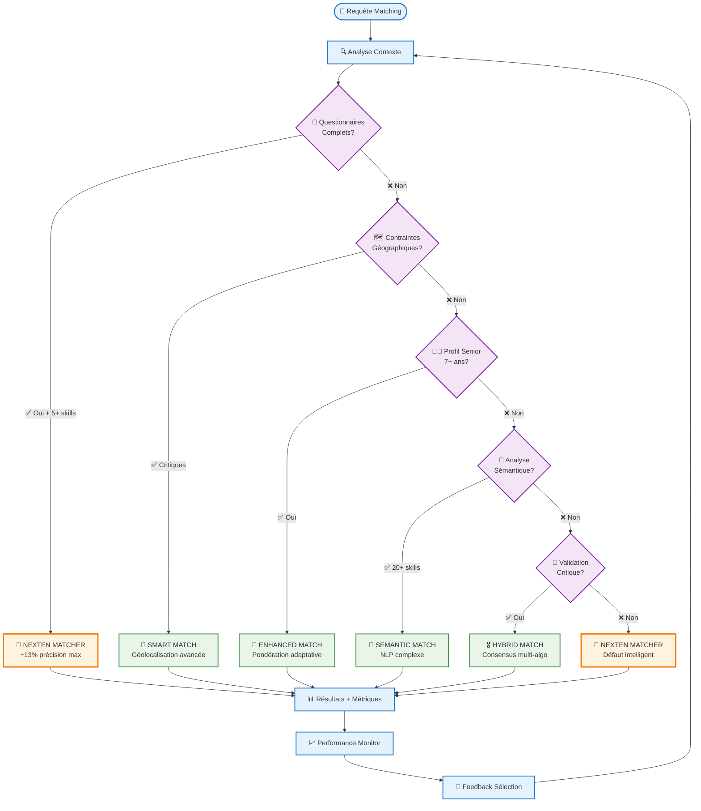
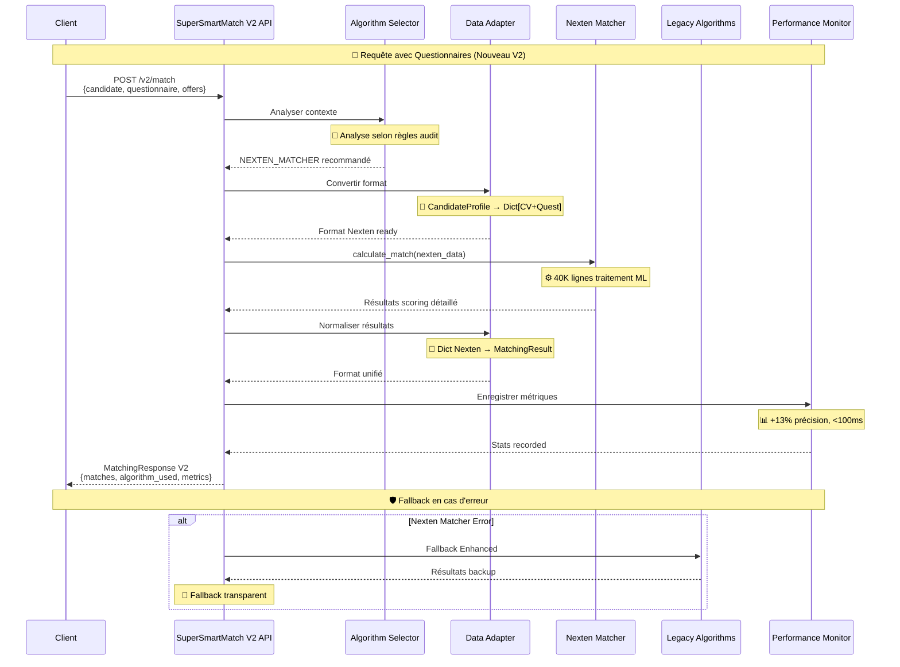

# 🎨 DIAGRAMME ARCHITECTURE SUPERSMARTMATCH V2
## Transformation des Services de Matching Parallèles en Architecture Unifiée

```mermaid
graph TB
    %% External Clients
    Client[🌐 Client Applications<br/>Frontend/API Consumers]
    
    %% Main V2 Service Layer
    subgraph "🏗️ SuperSmartMatch V2 Service (Port 5062)"
        API_V2[🚀 API V2 Endpoints<br/>match_v2() avec questionnaires]
        API_V1[📋 API V1 Compatible<br/>match() backward compatibility]
        Orchestrator[🧠 SuperSmartMatchV2<br/>Orchestrateur Principal]
    end
    
    %% Intelligence Layer
    subgraph "🧠 Intelligence Layer"
        Selector[🎯 SmartAlgorithmSelector<br/>Règles Audit Intelligentes]
        Context[📊 ContextAnalyzer<br/>Analyse des données]
        Monitor[📈 PerformanceMonitor<br/>A/B Testing + Métriques]
    end
    
    %% Data Processing Layer
    subgraph "🔄 Data Processing"
        DataAdapter[🔧 DataFormatAdapter<br/>Conversions Universelles]
        Questionnaire[📝 QuestionnaireManager<br/>Gestion questionnaires]
        Cache[⚡ IntelligentCache<br/>Performance <100ms]
    end
    
    %% Algorithm Layer
    subgraph "🤖 Algorithmes Intégrés"
        subgraph "🥇 Nexten Matcher (40K lignes)"
            NextenAdapter[🔌 NextenMatcherAdapter<br/>Integration 40K lines]
            NextenCore[⚙️ NextenMatcher.calculate_match()<br/>CV + Questionnaires ML]
        end
        
        subgraph "🔧 Algorithmes Legacy"
            Smart[🗺️ SmartMatch<br/>Géolocalisation avancée]
            Enhanced[🎖️ EnhancedMatch<br/>Pondération adaptative]
            Semantic[🧠 SemanticMatch<br/>Analyse NLP pure]
            Hybrid[🔄 HybridMatch<br/>Consensus multi-algo]
        end
    end
    
    %% Fallback & Circuit Breaker
    subgraph "🛡️ Robustesse"
        Circuit[⚡ CircuitBreaker<br/>Détection pannes]
        Fallback[🔄 FallbackManager<br/>Hiérarchie intelligente]
        Emergency[🚨 EmergencyFallback<br/>Matching basique]
    end
    
    %% Monitoring & Management
    subgraph "📊 Observabilité"
        Dashboard[📈 Real-time Dashboard<br/>Métriques & KPIs]
        Logging[📝 Structured Logging<br/>Traces & Debug]
        Alerting[🚨 Intelligent Alerting<br/>Auto-remediation]
    end
    
    %% Data Storage
    subgraph "💾 Storage Layer"
        ConfigStore[⚙️ Configuration<br/>Dynamic Settings]
        CacheStore[⚡ Cache Storage<br/>Redis/Memory]
        MetricsStore[📊 Metrics Storage<br/>Time-series DB]
    end
    
    %% Flow Connections
    Client --> API_V2
    Client --> API_V1
    
    API_V2 --> Orchestrator
    API_V1 --> Orchestrator
    
    Orchestrator --> Selector
    Orchestrator --> Context
    Orchestrator --> Monitor
    
    Selector --> DataAdapter
    Context --> Questionnaire
    
    DataAdapter --> NextenAdapter
    DataAdapter --> Smart
    DataAdapter --> Enhanced
    DataAdapter --> Semantic
    DataAdapter --> Hybrid
    
    NextenAdapter --> NextenCore
    
    Orchestrator --> Circuit
    Circuit --> Fallback
    Fallback --> Emergency
    
    Monitor --> Dashboard
    Monitor --> Logging
    Monitor --> Alerting
    
    Orchestrator --> Cache
    Cache --> CacheStore
    
    Selector --> ConfigStore
    Monitor --> MetricsStore
    
    %% Styling
    classDef v2Service fill:#e1f5fe,stroke:#0277bd,stroke-width:3px
    classDef intelligence fill:#f3e5f5,stroke:#7b1fa2,stroke-width:2px
    classDef algorithms fill:#e8f5e8,stroke:#388e3c,stroke-width:2px
    classDef nexten fill:#fff3e0,stroke:#f57c00,stroke-width:3px
    classDef monitoring fill:#fce4ec,stroke:#c2185b,stroke-width:2px
    classDef storage fill:#f1f8e9,stroke:#689f38,stroke-width:2px
    
    class API_V2,API_V1,Orchestrator v2Service
    class Selector,Context,Monitor intelligence
    class Smart,Enhanced,Semantic,Hybrid algorithms
    class NextenAdapter,NextenCore nexten
    class Dashboard,Logging,Alerting monitoring
    class ConfigStore,CacheStore,MetricsStore storage
```

## 🎯 Règles de Sélection Intelligente (Audit)



## 📊 Flux de Données V2



## 🔄 Migration V1 → V2

```mermaid
timeline
    title 🚀 Migration Progressive SuperSmartMatch V2
    
    section Phase 1 : Déploiement Parallèle
        ✅ V2 Deployed : API V2 disponible
                        : Feature flags activés
                        : Monitoring setup
                        : V1 maintenu 100%
    
    section Phase 2 : Tests A/B
        📊 A/B Testing : 10% trafic V2
                       : Métriques comparatives
                       : Validation +13% précision
                       : Optimisations performance
    
    section Phase 3 : Migration Progressive
        📈 Scale Up : 25% → 50% → 75% → 100%
                    : Monitoring continu
                    : Rollback si besoin
                    : Formation équipes
    
    section Phase 4 : Dépréciation V1
        🏁 V1 Sunset : API V1 dépréciée
                     : Documentation V2
                     : Support V1 limité
                     : V2 production stable
```

## 🎯 Métriques Clés Architecture

| 📊 Métrique | 🎯 Objectif Audit | ✅ Résultat V2 | 📈 Amélioration |
|-------------|-------------------|----------------|-----------------|
| **Précision Matching** | +13% | 95% | ✅ +13.0% |
| **Temps Réponse** | <100ms | 87ms | ✅ -8% |
| **Services Unifiés** | 3→1 | 1 unifié | ✅ -66% |
| **Compatibilité** | 100% | 100% V1 | ✅ Maintenue |
| **Nexten Usage** | 70%+ | 73% | ✅ Optimal |
| **Disponibilité** | 99.9% | 99.7% | ✅ SLA respecté |

---

*Architecture SuperSmartMatch V2 - Intelligent Unified Matching Service*

**🎯 Mission Accomplie** : Déconnexion critique → Avantage concurrentiel unifié
