# SuperSmartMatch V2 - Diagrammes d'Architecture C4

## 1. Diagramme de Contexte (C4 Level 1)

```mermaid
graph TB
    %% External Systems
    CANDIDATE[👤 Candidat<br/>Recherche d'emploi]
    RECRUITER[🏢 Recruteur<br/>Recherche de talents]
    HR_PLATFORM[🔗 Plateforme RH<br/>LinkedIn, Indeed]
    MAPS_API[🗺️ Google Maps API<br/>Géolocalisation]
    EMAIL_SERVICE[📧 Service Email<br/>Notifications]
    
    %% Main System
    SSM[🎯 SuperSmartMatch V2<br/>Plateforme de Matching<br/>CV/Emploi]
    
    %% Relationships
    CANDIDATE -.->|Uploade CV, cherche emplois| SSM
    RECRUITER -.->|Poste des offres, cherche candidats| SSM
    SSM -.->|Récupère données de profil| HR_PLATFORM
    SSM -.->|Calcule distances, temps de trajet| MAPS_API
    SSM -.->|Envoie notifications| EMAIL_SERVICE
    
    style SSM fill:#4CAF50,stroke:#2E7D32,stroke-width:3px
    style CANDIDATE fill:#E3F2FD,stroke:#1976D2
    style RECRUITER fill:#FFF3E0,stroke:#F57C00
```



## 2. Diagramme de Conteneurs (C4 Level 2)

```mermaid
graph TB
    %% External Users
    USERS[👥 Utilisateurs<br/>Candidats & Recruteurs]
    
    %% Frontend
    WEB_APP[🌐 Application Web<br/>React.js<br/>Port: 3000]
    MOBILE_APP[📱 Application Mobile<br/>React Native<br/>iOS/Android]
    
    %% API Gateway
    API_GW[🚪 API Gateway<br/>Kong/Traefik<br/>Port: 80/443]
    
    %% Core Microservices
    GEOLOC_SVC[🗺️ Geolocation Service<br/>Spring Boot + PostGIS<br/>Port: 5101]
    SCORING_SVC[🎯 Scoring Engine<br/>Python FastAPI<br/>Port: 5102]
    TEMPORAL_SVC[⏰ Temporal Parser<br/>Node.js + TimeScaleDB<br/>Port: 5103]
    BEHAVIOR_SVC[🧠 Behavior Analysis<br/>Python ML<br/>Port: 5104]
    EXPLAINER_SVC[💬 Explainability Service<br/>Python NLP<br/>Port: 5105]
    ANALYTICS_SVC[📊 Analytics Service<br/>Scala + Spark<br/>Port: 5106]
    
    %% Databases
    POSTGRES[(🐘 PostgreSQL<br/>Master Data)]
    REDIS[(⚡ Redis Cluster<br/>Cache & Sessions)]
    ELASTICSEARCH[(🔍 Elasticsearch<br/>Search Engine)]
    TIMESCALE[(⏱️ TimeScaleDB<br/>Time Series)]
    CLICKHOUSE[(📈 ClickHouse<br/>Analytics)]
    
    %% Message Queue
    KAFKA[📤 Apache Kafka<br/>Event Streaming]
    
    %% External Services
    MAPS_API[🗺️ Maps APIs<br/>Google/Mapbox]
    GPT_API[🤖 OpenAI API<br/>GPT-4/Claude]
    
    %% Connections
    USERS --> WEB_APP
    USERS --> MOBILE_APP
    
    WEB_APP --> API_GW
    MOBILE_APP --> API_GW
    
    API_GW --> GEOLOC_SVC
    API_GW --> SCORING_SVC
    API_GW --> TEMPORAL_SVC
    API_GW --> BEHAVIOR_SVC
    API_GW --> EXPLAINER_SVC
    API_GW --> ANALYTICS_SVC
    
    GEOLOC_SVC --> POSTGRES
    GEOLOC_SVC --> REDIS
    GEOLOC_SVC --> MAPS_API
    
    SCORING_SVC --> REDIS
    SCORING_SVC --> ELASTICSEARCH
    SCORING_SVC --> KAFKA
    
    TEMPORAL_SVC --> TIMESCALE
    TEMPORAL_SVC --> KAFKA
    
    BEHAVIOR_SVC --> CLICKHOUSE
    BEHAVIOR_SVC --> KAFKA
    
    EXPLAINER_SVC --> GPT_API
    EXPLAINER_SVC --> REDIS
    
    ANALYTICS_SVC --> CLICKHOUSE
    ANALYTICS_SVC --> KAFKA
    
    style API_GW fill:#FF9800,stroke:#E65100,stroke-width:3px
    style SCORING_SVC fill:#4CAF50,stroke:#2E7D32,stroke-width:3px
```



## 3. Diagramme de Composants - Scoring Engine (C4 Level 3)

```mermaid
graph TB
    subgraph "🎯 Scoring Engine Service"
        %% API Layer
        API_CONTROLLER[📋 Matching Controller<br/>REST + GraphQL]
        GRAPHQL_RESOLVER[🔗 GraphQL Resolver<br/>Complex Queries]
        
        %% Business Logic
        MATCH_ORCHESTRATOR[🎼 Matching Orchestrator<br/>Workflow Management]
        WEIGHT_CALCULATOR[⚖️ Weight Calculator<br/>Dynamic Ponderation]
        SCORE_AGGREGATOR[🧮 Score Aggregator<br/>Multi-criteria Scoring]
        
        %% Algorithms
        SKILL_MATCHER[💼 Skills Matcher<br/>NLP + Semantic Matching]
        EXPERIENCE_ANALYZER[📊 Experience Analyzer<br/>Timeline Analysis]
        LOCATION_SCORER[📍 Location Scorer<br/>Distance + Travel Time]
        SALARY_COMPARATOR[💰 Salary Comparator<br/>Range Compatibility]
        
        %% Intelligence Layer
        ML_PREDICTOR[🤖 ML Predictor<br/>Scikit-learn Pipeline]
        PATTERN_DETECTOR[🔍 Pattern Detector<br/>Behavioral Analysis]
        EXPLAINER[💡 Explanation Generator<br/>Natural Language]
        
        %% Data Access
        CACHE_MANAGER[⚡ Cache Manager<br/>Redis Operations]
        SEARCH_CLIENT[🔍 Search Client<br/>Elasticsearch Queries]
        EVENT_PUBLISHER[📤 Event Publisher<br/>Kafka Producer]
    end
    
    %% External Dependencies
    REDIS_CACHE[(⚡ Redis Cache)]
    ELASTICSEARCH[(🔍 Elasticsearch)]
    KAFKA_TOPIC[📤 Kafka Topics]
    ML_MODELS[🧠 ML Model Store<br/>MLflow Registry]
    
    %% Flow
    API_CONTROLLER --> MATCH_ORCHESTRATOR
    GRAPHQL_RESOLVER --> MATCH_ORCHESTRATOR
    
    MATCH_ORCHESTRATOR --> WEIGHT_CALCULATOR
    MATCH_ORCHESTRATOR --> SCORE_AGGREGATOR
    
    SCORE_AGGREGATOR --> SKILL_MATCHER
    SCORE_AGGREGATOR --> EXPERIENCE_ANALYZER
    SCORE_AGGREGATOR --> LOCATION_SCORER
    SCORE_AGGREGATOR --> SALARY_COMPARATOR
    
    SKILL_MATCHER --> ML_PREDICTOR
    EXPERIENCE_ANALYZER --> PATTERN_DETECTOR
    LOCATION_SCORER --> CACHE_MANAGER
    
    ML_PREDICTOR --> ML_MODELS
    PATTERN_DETECTOR --> ML_MODELS
    
    SCORE_AGGREGATOR --> EXPLAINER
    EXPLAINER --> EVENT_PUBLISHER
    
    CACHE_MANAGER --> REDIS_CACHE
    SEARCH_CLIENT --> ELASTICSEARCH
    EVENT_PUBLISHER --> KAFKA_TOPIC
    
    style MATCH_ORCHESTRATOR fill:#4CAF50,stroke:#2E7D32,stroke-width:3px
    style ML_PREDICTOR fill:#9C27B0,stroke:#6A1B9A,stroke-width:2px
```



## 4. Diagramme de Code - Algorithm Interface (C4 Level 4)


## 5. Diagramme de Déploiement

```mermaid
graph TB
    subgraph "🌐 Internet"
        CDN[☁️ CloudFlare CDN<br/>Global Edge Locations]
        DNS[🌐 Route53 DNS<br/>Geolocation Routing]
    end
    
    subgraph "🛡️ Security Layer"
        WAF[🛡️ Web Application Firewall]
        LB[⚖️ Application Load Balancer<br/>SSL Termination]
    end
    
    subgraph "☸️ Kubernetes Cluster - Production"
        subgraph "🎯 API Gateway Namespace"
            API_GW_POD[🚪 API Gateway Pod<br/>Kong + Rate Limiting]
        end
        
        subgraph "🔧 Core Services Namespace"
            GEOLOC_PODS[🗺️ Geolocation Pods<br/>3 replicas + HPA]
            SCORING_PODS[🎯 Scoring Engine Pods<br/>5 replicas + VPA]
            TEMPORAL_PODS[⏰ Temporal Parser Pods<br/>2 replicas]
        end
        
        subgraph "🧠 ML Services Namespace"
            BEHAVIOR_PODS[🧠 Behavior Analysis Pods<br/>GPU enabled, 2 replicas]
            EXPLAINER_PODS[💬 Explainer Pods<br/>3 replicas]
        end
        
        subgraph "📊 Analytics Namespace"
            ANALYTICS_PODS[📊 Analytics Pods<br/>Spark cluster, 4 workers]
        end
    end
    
    subgraph "💾 Data Layer"
        POSTGRES_PRIMARY[(🐘 PostgreSQL Primary<br/>High Availability)]
        POSTGRES_REPLICA[(📖 PostgreSQL Read Replicas<br/>3 nodes)]
        
        REDIS_CLUSTER[(⚡ Redis Cluster<br/>6 nodes, 3 masters)]
        
        ELASTICSEARCH_CLUSTER[(🔍 Elasticsearch Cluster<br/>5 nodes, 2 replicas)]
        
        TIMESCALE_CLUSTER[(⏱️ TimeScaleDB Cluster<br/>3 nodes, streaming replication)]
        
        CLICKHOUSE_CLUSTER[(📈 ClickHouse Cluster<br/>4 shards, 2 replicas each)]
    end
    
    subgraph "📤 Message Queue"
        KAFKA_CLUSTER[📤 Apache Kafka Cluster<br/>5 brokers, 3 ZooKeeper]
    end
    
    subgraph "📈 Monitoring Stack"
        PROMETHEUS[📊 Prometheus<br/>Metrics Collection]
        GRAFANA[📈 Grafana<br/>Dashboards]
        JAEGER[🔍 Jaeger<br/>Distributed Tracing]
        ELASTICSEARCH_LOGS[(📝 Elasticsearch<br/>Centralized Logging)]
    end
    
    %% External Services
    subgraph "🔗 External APIs"
        GOOGLE_MAPS[🗺️ Google Maps API]
        OPENAI_API[🤖 OpenAI API]
        EMAIL_SVC[📧 SendGrid API]
    end
    
    %% Network Flow
    CDN --> WAF
    DNS --> LB
    WAF --> LB
    LB --> API_GW_POD
    
    API_GW_POD --> GEOLOC_PODS
    API_GW_POD --> SCORING_PODS
    API_GW_POD --> TEMPORAL_PODS
    API_GW_POD --> BEHAVIOR_PODS
    API_GW_POD --> EXPLAINER_PODS
    API_GW_POD --> ANALYTICS_PODS
    
    GEOLOC_PODS --> POSTGRES_PRIMARY
    GEOLOC_PODS --> REDIS_CLUSTER
    GEOLOC_PODS --> GOOGLE_MAPS
    
    SCORING_PODS --> REDIS_CLUSTER
    SCORING_PODS --> ELASTICSEARCH_CLUSTER
    SCORING_PODS --> KAFKA_CLUSTER
    
    TEMPORAL_PODS --> TIMESCALE_CLUSTER
    TEMPORAL_PODS --> KAFKA_CLUSTER
    
    BEHAVIOR_PODS --> CLICKHOUSE_CLUSTER
    BEHAVIOR_PODS --> KAFKA_CLUSTER
    
    EXPLAINER_PODS --> OPENAI_API
    EXPLAINER_PODS --> REDIS_CLUSTER
    
    ANALYTICS_PODS --> CLICKHOUSE_CLUSTER
    ANALYTICS_PODS --> KAFKA_CLUSTER
    
    %% Monitoring
    GEOLOC_PODS -.-> PROMETHEUS
    SCORING_PODS -.-> PROMETHEUS
    TEMPORAL_PODS -.-> PROMETHEUS
    BEHAVIOR_PODS -.-> PROMETHEUS
    EXPLAINER_PODS -.-> PROMETHEUS
    ANALYTICS_PODS -.-> PROMETHEUS
    
    PROMETHEUS --> GRAFANA
    
    style CDN fill:#FF9800,stroke:#E65100
    style SCORING_PODS fill:#4CAF50,stroke:#2E7D32,stroke-width:3px
    style KAFKA_CLUSTER fill:#795548,stroke:#3E2723,stroke-width:2px
```



## 6. Flux de données - Processus de Matching


## Architecture Constraints & Non-Functional Requirements

### Performance Requirements
```yaml
latency_requirements:
  single_match: <200ms (P95)
  bulk_10_matches: <2s (P99)
  bulk_100_matches: <10s (P99)
  
throughput_requirements:
  concurrent_users: 10,000
  requests_per_second: 1,000
  matching_requests_per_minute: 1,000+

availability_requirements:
  uptime: 99.9% (8.77h downtime/year)
  recovery_time: <5 minutes
  backup_recovery: <1 hour
```

### Scalability Strategy
```yaml
horizontal_scaling:
  api_gateway: Auto-scale based on CPU (50-80%)
  scoring_engine: Auto-scale based on queue depth
  geolocation: Auto-scale based on memory (70%)
  
vertical_scaling:
  ml_services: GPU scaling based on model complexity
  analytics: Memory scaling based on data volume
  
data_partitioning:
  users: Partition by region (EU, US, APAC)
  jobs: Partition by industry + creation_date
  matches: Partition by user_id hash + timestamp
```

Cette architecture C4 complète définit la structure technique de SuperSmartMatch V2 avec tous les niveaux de détail nécessaires pour l'implémentation et le déploiement en production.
