# SuperSmartMatch V2 - Database Schema & Data Architecture

## 🏗️ Architecture de Données - Vue d'ensemble

SuperSmartMatch V2 utilise une architecture **Database-per-Service** avec des bases de données spécialisées pour chaque domaine métier.

### 📊 Répartition des Données par Service

```mermaid
graph TB
    subgraph "🎯 Core Service"
        POSTGRES_CORE[(PostgreSQL<br/>Master Data)]
    end
    
    subgraph "🗺️ Geolocation Service"
        POSTGRES_GEO[(PostgreSQL + PostGIS<br/>Spatial Data)]
    end
    
    subgraph "⏰ Temporal Service"
        TIMESCALE[(TimeScaleDB<br/>Time Series)]
    end
    
    subgraph "🧠 Behavior Service"
        CLICKHOUSE[(ClickHouse<br/>Analytics)]
    end
    
    subgraph "🔍 Search Service"
        ELASTICSEARCH[(Elasticsearch<br/>Full-text Search)]
    end
    
    subgraph "⚡ Cache Layer"
        REDIS[(Redis Cluster<br/>Cache & Sessions)]
    end
```



---

## 1. 🎯 Core Service - PostgreSQL Master Database

### Modèle Logique

```sql
-- ================================
-- CORE SERVICE DATABASE SCHEMA
-- ================================

-- Users et Authentication
CREATE TABLE users (
    user_id UUID PRIMARY KEY DEFAULT gen_random_uuid(),
    email VARCHAR(255) UNIQUE NOT NULL,
    password_hash VARCHAR(255) NOT NULL,
    user_type VARCHAR(20) NOT NULL CHECK (user_type IN ('candidate', 'recruiter', 'admin')),
    status VARCHAR(20) DEFAULT 'active' CHECK (status IN ('active', 'inactive', 'suspended')),
    email_verified BOOLEAN DEFAULT FALSE,
    terms_accepted_at TIMESTAMP WITH TIME ZONE,
    privacy_accepted_at TIMESTAMP WITH TIME ZONE,
    last_login_at TIMESTAMP WITH TIME ZONE,
    failed_login_attempts INTEGER DEFAULT 0,
    account_locked_until TIMESTAMP WITH TIME ZONE,
    created_at TIMESTAMP WITH TIME ZONE DEFAULT CURRENT_TIMESTAMP,
    updated_at TIMESTAMP WITH TIME ZONE DEFAULT CURRENT_TIMESTAMP,
    
    -- Indexes
    CONSTRAINT users_email_idx UNIQUE (email)
);

-- Sessions et JWT tokens
CREATE TABLE user_sessions (
    session_id UUID PRIMARY KEY DEFAULT gen_random_uuid(),
    user_id UUID NOT NULL REFERENCES users(user_id) ON DELETE CASCADE,
    refresh_token_hash VARCHAR(255) NOT NULL,
    expires_at TIMESTAMP WITH TIME ZONE NOT NULL,
    user_agent TEXT,
    ip_address INET,
    is_revoked BOOLEAN DEFAULT FALSE,
    created_at TIMESTAMP WITH TIME ZONE DEFAULT CURRENT_TIMESTAMP,
    
    -- Indexes
    INDEX idx_user_sessions_user_id (user_id),
    INDEX idx_user_sessions_expires_at (expires_at),
    INDEX idx_user_sessions_token_hash (refresh_token_hash)
);

-- Candidate Profiles
CREATE TABLE candidate_profiles (
    candidate_id UUID PRIMARY KEY DEFAULT gen_random_uuid(),
    user_id UUID NOT NULL REFERENCES users(user_id) ON DELETE CASCADE,
    first_name VARCHAR(100),
    last_name VARCHAR(100),
    phone VARCHAR(20),
    date_of_birth DATE,
    nationality VARCHAR(3), -- ISO 3166-1 alpha-3
    current_title VARCHAR(200),
    experience_years INTEGER DEFAULT 0,
    availability_status VARCHAR(20) DEFAULT 'open' CHECK (
        availability_status IN ('open', 'passive', 'not_looking', 'hired')
    ),
    expected_salary_min INTEGER,
    expected_salary_max INTEGER,
    currency VARCHAR(3) DEFAULT 'EUR',
    work_authorization JSONB, -- visa status, work permits
    profile_completeness INTEGER DEFAULT 0, -- 0-100%
    profile_visibility VARCHAR(20) DEFAULT 'public' CHECK (
        profile_visibility IN ('public', 'limited', 'private')
    ),
    last_activity_at TIMESTAMP WITH TIME ZONE,
    created_at TIMESTAMP WITH TIME ZONE DEFAULT CURRENT_TIMESTAMP,
    updated_at TIMESTAMP WITH TIME ZONE DEFAULT CURRENT_TIMESTAMP,
    
    -- Full-text search
    search_vector TSVECTOR,
    
    -- Indexes
    CONSTRAINT candidate_profiles_user_id_unique UNIQUE (user_id),
    INDEX idx_candidate_profiles_status (availability_status),
    INDEX idx_candidate_profiles_salary (expected_salary_min, expected_salary_max),
    INDEX idx_candidate_profiles_search (search_vector) USING GIN
);

-- Skills Taxonomy
CREATE TABLE skills_taxonomy (
    skill_id UUID PRIMARY KEY DEFAULT gen_random_uuid(),
    skill_name VARCHAR(100) NOT NULL,
    category VARCHAR(50) NOT NULL, -- technical, soft, language, tool, framework
    parent_skill_id UUID REFERENCES skills_taxonomy(skill_id),
    aliases JSONB, -- alternative names
    description TEXT,
    skill_level_max INTEGER DEFAULT 5, -- max level for this skill
    is_verified BOOLEAN DEFAULT FALSE,
    verification_source VARCHAR(100),
    popularity_score INTEGER DEFAULT 0,
    market_demand DECIMAL(3,2) DEFAULT 0.0, -- 0.0 to 10.0
    created_at TIMESTAMP WITH TIME ZONE DEFAULT CURRENT_TIMESTAMP,
    
    -- Indexes
    CONSTRAINT skills_taxonomy_name_unique UNIQUE (skill_name),
    INDEX idx_skills_taxonomy_category (category),
    INDEX idx_skills_taxonomy_parent (parent_skill_id),
    INDEX idx_skills_taxonomy_popularity (popularity_score DESC)
);

-- Candidate Skills
CREATE TABLE candidate_skills (
    candidate_skill_id UUID PRIMARY KEY DEFAULT gen_random_uuid(),
    candidate_id UUID NOT NULL REFERENCES candidate_profiles(candidate_id) ON DELETE CASCADE,
    skill_id UUID NOT NULL REFERENCES skills_taxonomy(skill_id),
    skill_level INTEGER DEFAULT 1 CHECK (skill_level BETWEEN 1 AND 5),
    years_experience DECIMAL(3,1) DEFAULT 0.0,
    is_primary BOOLEAN DEFAULT FALSE,
    last_used_date DATE,
    proficiency_score DECIMAL(3,2), -- ML-calculated proficiency
    verification_status VARCHAR(20) DEFAULT 'self_declared' CHECK (
        verification_status IN ('self_declared', 'assessed', 'certified', 'verified')
    ),
    verification_details JSONB,
    created_at TIMESTAMP WITH TIME ZONE DEFAULT CURRENT_TIMESTAMP,
    updated_at TIMESTAMP WITH TIME ZONE DEFAULT CURRENT_TIMESTAMP,
    
    -- Constraints
    CONSTRAINT candidate_skills_unique UNIQUE (candidate_id, skill_id),
    
    -- Indexes
    INDEX idx_candidate_skills_candidate (candidate_id),
    INDEX idx_candidate_skills_skill (skill_id),
    INDEX idx_candidate_skills_level (skill_level DESC),
    INDEX idx_candidate_skills_primary (candidate_id, is_primary) WHERE is_primary = TRUE
);

-- Work Experience
CREATE TABLE work_experiences (
    experience_id UUID PRIMARY KEY DEFAULT gen_random_uuid(),
    candidate_id UUID NOT NULL REFERENCES candidate_profiles(candidate_id) ON DELETE CASCADE,
    company_name VARCHAR(200) NOT NULL,
    position_title VARCHAR(200) NOT NULL,
    employment_type VARCHAR(50), -- full-time, part-time, contract, intern
    industry VARCHAR(100),
    company_size VARCHAR(20), -- startup, small, medium, large, enterprise
    start_date DATE NOT NULL,
    end_date DATE, -- NULL for current position
    is_current BOOLEAN DEFAULT FALSE,
    location JSONB, -- {city, country, remote}
    description TEXT,
    key_achievements TEXT[],
    skills_used JSONB, -- skills used in this role
    salary_range JSONB, -- {min, max, currency} - encrypted
    management_experience BOOLEAN DEFAULT FALSE,
    team_size INTEGER,
    
    -- Career progression tracking
    seniority_level VARCHAR(20), -- entry, junior, mid, senior, lead, executive
    promotion_from UUID REFERENCES work_experiences(experience_id),
    
    created_at TIMESTAMP WITH TIME ZONE DEFAULT CURRENT_TIMESTAMP,
    updated_at TIMESTAMP WITH TIME ZONE DEFAULT CURRENT_TIMESTAMP,
    
    -- Constraints
    CHECK (start_date <= COALESCE(end_date, CURRENT_DATE)),
    CHECK (NOT (is_current = TRUE AND end_date IS NOT NULL)),
    
    -- Indexes
    INDEX idx_work_experiences_candidate (candidate_id),
    INDEX idx_work_experiences_dates (start_date, end_date),
    INDEX idx_work_experiences_current (candidate_id, is_current) WHERE is_current = TRUE,
    INDEX idx_work_experiences_company (company_name),
    INDEX idx_work_experiences_seniority (seniority_level)
);

-- Education
CREATE TABLE education (
    education_id UUID PRIMARY KEY DEFAULT gen_random_uuid(),
    candidate_id UUID NOT NULL REFERENCES candidate_profiles(candidate_id) ON DELETE CASCADE,
    institution_name VARCHAR(200) NOT NULL,
    degree_type VARCHAR(50), -- bachelor, master, phd, certificate, diploma
    field_of_study VARCHAR(200),
    grade VARCHAR(20), -- GPA, mention, etc.
    start_date DATE,
    end_date DATE,
    is_completed BOOLEAN DEFAULT TRUE,
    location JSONB, -- {city, country}
    description TEXT,
    relevant_coursework TEXT[],
    honors_awards TEXT[],
    
    created_at TIMESTAMP WITH TIME ZONE DEFAULT CURRENT_TIMESTAMP,
    
    -- Indexes
    INDEX idx_education_candidate (candidate_id),
    INDEX idx_education_institution (institution_name),
    INDEX idx_education_degree (degree_type),
    INDEX idx_education_dates (start_date, end_date)
);

-- Certifications
CREATE TABLE certifications (
    certification_id UUID PRIMARY KEY DEFAULT gen_random_uuid(),
    candidate_id UUID NOT NULL REFERENCES candidate_profiles(candidate_id) ON DELETE CASCADE,
    certification_name VARCHAR(200) NOT NULL,
    issuing_organization VARCHAR(200) NOT NULL,
    issue_date DATE,
    expiration_date DATE,
    credential_id VARCHAR(100),
    credential_url TEXT,
    verification_status VARCHAR(20) DEFAULT 'unverified' CHECK (
        verification_status IN ('unverified', 'verified', 'expired', 'revoked')
    ),
    
    created_at TIMESTAMP WITH TIME ZONE DEFAULT CURRENT_TIMESTAMP,
    
    -- Indexes
    INDEX idx_certifications_candidate (candidate_id),
    INDEX idx_certifications_name (certification_name),
    INDEX idx_certifications_org (issuing_organization),
    INDEX idx_certifications_expiry (expiration_date) WHERE expiration_date IS NOT NULL
);

-- Languages
CREATE TABLE candidate_languages (
    language_id UUID PRIMARY KEY DEFAULT gen_random_uuid(),
    candidate_id UUID NOT NULL REFERENCES candidate_profiles(candidate_id) ON DELETE CASCADE,
    language_code VARCHAR(3) NOT NULL, -- ISO 639-2
    language_name VARCHAR(50) NOT NULL,
    proficiency_level VARCHAR(20) NOT NULL CHECK (
        proficiency_level IN ('beginner', 'elementary', 'intermediate', 'advanced', 'native')
    ),
    cefr_level VARCHAR(2), -- A1, A2, B1, B2, C1, C2
    is_native BOOLEAN DEFAULT FALSE,
    certification_name VARCHAR(100),
    
    created_at TIMESTAMP WITH TIME ZONE DEFAULT CURRENT_TIMESTAMP,
    
    -- Constraints
    CONSTRAINT candidate_languages_unique UNIQUE (candidate_id, language_code),
    
    -- Indexes
    INDEX idx_candidate_languages_candidate (candidate_id),
    INDEX idx_candidate_languages_proficiency (proficiency_level)
);

-- Companies (for job postings)
CREATE TABLE companies (
    company_id UUID PRIMARY KEY DEFAULT gen_random_uuid(),
    company_name VARCHAR(200) NOT NULL,
    legal_name VARCHAR(200),
    industry VARCHAR(100),
    company_size VARCHAR(20), -- startup, small, medium, large, enterprise
    founded_year INTEGER,
    headquarters_location JSONB,
    website_url TEXT,
    logo_url TEXT,
    description TEXT,
    company_culture JSONB, -- values, benefits, perks
    glassdoor_rating DECIMAL(2,1),
    employee_count_range VARCHAR(20),
    stock_symbol VARCHAR(10),
    is_verified BOOLEAN DEFAULT FALSE,
    verification_date TIMESTAMP WITH TIME ZONE,
    
    created_at TIMESTAMP WITH TIME ZONE DEFAULT CURRENT_TIMESTAMP,
    updated_at TIMESTAMP WITH TIME ZONE DEFAULT CURRENT_TIMESTAMP,
    
    -- Full-text search
    search_vector TSVECTOR,
    
    -- Indexes
    INDEX idx_companies_name (company_name),
    INDEX idx_companies_industry (industry),
    INDEX idx_companies_size (company_size),
    INDEX idx_companies_search (search_vector) USING GIN
);

-- Job Postings
CREATE TABLE job_postings (
    job_id UUID PRIMARY KEY DEFAULT gen_random_uuid(),
    company_id UUID NOT NULL REFERENCES companies(company_id),
    recruiter_id UUID REFERENCES users(user_id), -- posting recruiter
    title VARCHAR(200) NOT NULL,
    department VARCHAR(100),
    employment_type VARCHAR(50) NOT NULL CHECK (
        employment_type IN ('full-time', 'part-time', 'contract', 'temporary', 'internship')
    ),
    seniority_level VARCHAR(20) CHECK (
        seniority_level IN ('entry', 'junior', 'mid', 'senior', 'lead', 'executive')
    ),
    experience_required_min INTEGER DEFAULT 0,
    experience_required_max INTEGER,
    
    -- Job description
    description TEXT NOT NULL,
    responsibilities TEXT[],
    requirements TEXT[],
    nice_to_have TEXT[],
    benefits TEXT[],
    
    -- Compensation
    salary_min INTEGER,
    salary_max INTEGER,
    salary_currency VARCHAR(3) DEFAULT 'EUR',
    salary_period VARCHAR(20) DEFAULT 'yearly', -- yearly, monthly, hourly
    equity_offered BOOLEAN DEFAULT FALSE,
    bonus_structure TEXT,
    
    -- Location and remote work
    work_location JSONB NOT NULL, -- {type: 'remote'/'onsite'/'hybrid', locations: [...]}
    remote_policy VARCHAR(20) DEFAULT 'no' CHECK (
        remote_policy IN ('no', 'partial', 'full', 'flexible')
    ),
    
    -- Status and timing
    status VARCHAR(20) DEFAULT 'active' CHECK (
        status IN ('draft', 'active', 'paused', 'filled', 'expired', 'cancelled')
    ),
    posted_at TIMESTAMP WITH TIME ZONE DEFAULT CURRENT_TIMESTAMP,
    expires_at TIMESTAMP WITH TIME ZONE,
    filled_at TIMESTAMP WITH TIME ZONE,
    application_deadline DATE,
    
    -- Application process
    application_url TEXT,
    application_email VARCHAR(255),
    application_instructions TEXT,
    
    -- SEO and search
    slug VARCHAR(300) UNIQUE,
    search_vector TSVECTOR,
    
    -- Analytics
    view_count INTEGER DEFAULT 0,
    application_count INTEGER DEFAULT 0,
    
    created_at TIMESTAMP WITH TIME ZONE DEFAULT CURRENT_TIMESTAMP,
    updated_at TIMESTAMP WITH TIME ZONE DEFAULT CURRENT_TIMESTAMP,
    
    -- Indexes
    INDEX idx_job_postings_company (company_id),
    INDEX idx_job_postings_recruiter (recruiter_id),
    INDEX idx_job_postings_status (status),
    INDEX idx_job_postings_location (work_location) USING GIN,
    INDEX idx_job_postings_salary (salary_min, salary_max),
    INDEX idx_job_postings_posted (posted_at DESC),
    INDEX idx_job_postings_search (search_vector) USING GIN,
    INDEX idx_job_postings_seniority (seniority_level),
    INDEX idx_job_postings_employment (employment_type)
);

-- Job Required Skills
CREATE TABLE job_required_skills (
    job_skill_id UUID PRIMARY KEY DEFAULT gen_random_uuid(),
    job_id UUID NOT NULL REFERENCES job_postings(job_id) ON DELETE CASCADE,
    skill_id UUID NOT NULL REFERENCES skills_taxonomy(skill_id),
    requirement_type VARCHAR(20) NOT NULL CHECK (
        requirement_type IN ('required', 'preferred', 'nice_to_have')
    ),
    minimum_level INTEGER DEFAULT 1 CHECK (minimum_level BETWEEN 1 AND 5),
    minimum_years DECIMAL(3,1) DEFAULT 0.0,
    weight DECIMAL(3,2) DEFAULT 1.0, -- importance weight
    
    created_at TIMESTAMP WITH TIME ZONE DEFAULT CURRENT_TIMESTAMP,
    
    -- Constraints
    CONSTRAINT job_required_skills_unique UNIQUE (job_id, skill_id),
    
    -- Indexes
    INDEX idx_job_required_skills_job (job_id),
    INDEX idx_job_required_skills_skill (skill_id),
    INDEX idx_job_required_skills_type (requirement_type)
);
```

### Triggers et Fonctions

```sql
-- ================================
-- TRIGGERS AND FUNCTIONS
-- ================================

-- Update search vectors for candidates
CREATE OR REPLACE FUNCTION update_candidate_search_vector()
RETURNS TRIGGER AS $$
BEGIN
    NEW.search_vector := 
        setweight(to_tsvector('english', COALESCE(NEW.first_name, '')), 'A') ||
        setweight(to_tsvector('english', COALESCE(NEW.last_name, '')), 'A') ||
        setweight(to_tsvector('english', COALESCE(NEW.current_title, '')), 'B');
    
    NEW.updated_at := CURRENT_TIMESTAMP;
    RETURN NEW;
END;
$$ LANGUAGE plpgsql;

CREATE TRIGGER candidate_profiles_search_update
    BEFORE INSERT OR UPDATE ON candidate_profiles
    FOR EACH ROW EXECUTE FUNCTION update_candidate_search_vector();

-- Update search vectors for jobs
CREATE OR REPLACE FUNCTION update_job_search_vector()
RETURNS TRIGGER AS $$
BEGIN
    NEW.search_vector := 
        setweight(to_tsvector('english', COALESCE(NEW.title, '')), 'A') ||
        setweight(to_tsvector('english', COALESCE(NEW.description, '')), 'B') ||
        setweight(to_tsvector('english', array_to_string(NEW.requirements, ' ')), 'C');
    
    NEW.updated_at := CURRENT_TIMESTAMP;
    RETURN NEW;
END;
$$ LANGUAGE plpgsql;

CREATE TRIGGER job_postings_search_update
    BEFORE INSERT OR UPDATE ON job_postings
    FOR EACH ROW EXECUTE FUNCTION update_job_search_vector();

-- Automatic slug generation for jobs
CREATE OR REPLACE FUNCTION generate_job_slug()
RETURNS TRIGGER AS $$
BEGIN
    IF NEW.slug IS NULL THEN
        NEW.slug := lower(regexp_replace(
            NEW.title || '-' || (SELECT company_name FROM companies WHERE company_id = NEW.company_id),
            '[^a-zA-Z0-9]+', '-', 'g'
        ));
        
        -- Ensure uniqueness
        WHILE EXISTS (SELECT 1 FROM job_postings WHERE slug = NEW.slug AND job_id != NEW.job_id) LOOP
            NEW.slug := NEW.slug || '-' || substring(NEW.job_id::text from 1 for 8);
        END LOOP;
    END IF;
    
    RETURN NEW;
END;
$$ LANGUAGE plpgsql;

CREATE TRIGGER job_postings_slug_generation
    BEFORE INSERT OR UPDATE ON job_postings
    FOR EACH ROW EXECUTE FUNCTION generate_job_slug();
```

---

## 2. 🗺️ Geolocation Service - PostgreSQL + PostGIS

```sql
-- ================================
-- GEOLOCATION SERVICE DATABASE
-- ================================

-- Enable PostGIS extension
CREATE EXTENSION IF NOT EXISTS postgis;
CREATE EXTENSION IF NOT EXISTS postgis_topology;

-- Locations avec données géospatiales
CREATE TABLE locations (
    location_id UUID PRIMARY KEY DEFAULT gen_random_uuid(),
    formatted_address TEXT NOT NULL,
    street_number VARCHAR(20),
    street_name VARCHAR(200),
    city VARCHAR(100) NOT NULL,
    region VARCHAR(100),
    country VARCHAR(100) NOT NULL,
    country_code VARCHAR(2) NOT NULL, -- ISO 3166-1 alpha-2
    postal_code VARCHAR(20),
    
    -- PostGIS geometry column
    coordinates GEOMETRY(POINT, 4326) NOT NULL,
    
    -- Geocoding metadata
    geocoding_accuracy VARCHAR(20), -- rooftop, range_interpolated, geometric_center
    geocoding_source VARCHAR(50), -- google, mapbox, nominatim
    place_types TEXT[], -- neighborhood, city, country
    
    -- Timezone
    timezone VARCHAR(50),
    
    -- Caching and performance
    geocoded_at TIMESTAMP WITH TIME ZONE DEFAULT CURRENT_TIMESTAMP,
    cache_expires_at TIMESTAMP WITH TIME ZONE DEFAULT (CURRENT_TIMESTAMP + INTERVAL '30 days'),
    
    created_at TIMESTAMP WITH TIME ZONE DEFAULT CURRENT_TIMESTAMP,
    
    -- Spatial index
    CONSTRAINT locations_coordinates_idx EXCLUDE USING GIST (coordinates WITH =)
);

-- Spatial index for fast proximity queries
CREATE INDEX idx_locations_coordinates ON locations USING GIST (coordinates);
CREATE INDEX idx_locations_city ON locations (city);
CREATE INDEX idx_locations_country ON locations (country_code);

-- Distance calculations cache
CREATE TABLE distance_calculations (
    calculation_id UUID PRIMARY KEY DEFAULT gen_random_uuid(),
    origin_location_id UUID NOT NULL REFERENCES locations(location_id),
    destination_location_id UUID NOT NULL REFERENCES locations(location_id),
    
    -- Distance metrics
    straight_line_distance_km DECIMAL(8,2), -- haversine distance
    driving_distance_km DECIMAL(8,2),
    driving_time_minutes INTEGER,
    public_transport_time_minutes INTEGER,
    walking_time_minutes INTEGER,
    cycling_time_minutes INTEGER,
    
    -- Route information
    route_polyline TEXT, -- encoded polyline
    traffic_info JSONB, -- current traffic conditions
    toll_info JSONB, -- toll roads information
    
    -- Metadata
    calculation_source VARCHAR(50), -- google, mapbox, osrm
    calculated_at TIMESTAMP WITH TIME ZONE DEFAULT CURRENT_TIMESTAMP,
    cache_expires_at TIMESTAMP WITH TIME ZONE DEFAULT (CURRENT_TIMESTAMP + INTERVAL '1 hour'),
    
    -- Constraints
    CONSTRAINT distance_calculations_unique UNIQUE (origin_location_id, destination_location_id),
    
    -- Indexes
    INDEX idx_distance_calculations_origin (origin_location_id),
    INDEX idx_distance_calculations_destination (destination_location_id),
    INDEX idx_distance_calculations_expires (cache_expires_at)
);

-- User location preferences
CREATE TABLE user_location_preferences (
    preference_id UUID PRIMARY KEY DEFAULT gen_random_uuid(),
    user_id UUID NOT NULL, -- Foreign key to core service
    location_id UUID NOT NULL REFERENCES locations(location_id),
    location_type VARCHAR(20) NOT NULL CHECK (
        location_type IN ('home', 'work', 'preferred', 'excluded')
    ),
    max_commute_distance_km INTEGER,
    max_commute_time_minutes INTEGER,
    transport_modes TEXT[], -- driving, public_transport, walking, cycling
    is_flexible BOOLEAN DEFAULT FALSE,
    
    created_at TIMESTAMP WITH TIME ZONE DEFAULT CURRENT_TIMESTAMP,
    updated_at TIMESTAMP WITH TIME ZONE DEFAULT CURRENT_TIMESTAMP,
    
    -- Constraints
    CONSTRAINT user_location_preferences_unique UNIQUE (user_id, location_id, location_type),
    
    -- Indexes
    INDEX idx_user_location_preferences_user (user_id),
    INDEX idx_user_location_preferences_type (location_type)
);

-- Geospatial functions
CREATE OR REPLACE FUNCTION calculate_distance_km(
    lat1 DECIMAL, lon1 DECIMAL, 
    lat2 DECIMAL, lon2 DECIMAL
) RETURNS DECIMAL AS $$
BEGIN
    RETURN ST_Distance(
        ST_GeogFromText('POINT(' || lon1 || ' ' || lat1 || ')'),
        ST_GeogFromText('POINT(' || lon2 || ' ' || lat2 || ')')
    ) / 1000.0; -- Convert meters to kilometers
END;
$$ LANGUAGE plpgsql;

-- Find nearby locations
CREATE OR REPLACE FUNCTION find_nearby_locations(
    center_lat DECIMAL,
    center_lon DECIMAL,
    radius_km INTEGER DEFAULT 50
) RETURNS TABLE (
    location_id UUID,
    distance_km DECIMAL,
    formatted_address TEXT
) AS $$
BEGIN
    RETURN QUERY
    SELECT 
        l.location_id,
        (ST_Distance(
            ST_GeogFromText('POINT(' || center_lon || ' ' || center_lat || ')'),
            l.coordinates::geography
        ) / 1000.0)::DECIMAL AS distance_km,
        l.formatted_address
    FROM locations l
    WHERE ST_DWithin(
        ST_GeogFromText('POINT(' || center_lon || ' ' || center_lat || ')'),
        l.coordinates::geography,
        radius_km * 1000
    )
    ORDER BY distance_km;
END;
$$ LANGUAGE plpgsql;
```

---

## 3. ⏰ Temporal Service - TimeScaleDB

```sql
-- ================================
-- TEMPORAL SERVICE DATABASE (TimeScaleDB)
-- ================================

-- Create TimescaleDB extension
CREATE EXTENSION IF NOT EXISTS timescaledb;

-- User availability patterns
CREATE TABLE availability_patterns (
    availability_id UUID NOT NULL DEFAULT gen_random_uuid(),
    user_id UUID NOT NULL, -- Foreign key to core service
    timestamp TIMESTAMPTZ NOT NULL,
    
    -- Availability windows
    availability_type VARCHAR(20) NOT NULL CHECK (
        availability_type IN ('work_hours', 'interview_slot', 'unavailable', 'preferred')
    ),
    day_of_week INTEGER CHECK (day_of_week BETWEEN 0 AND 6), -- 0=Sunday
    start_time TIME,
    end_time TIME,
    timezone VARCHAR(50) NOT NULL,
    
    -- Flexibility and preferences
    flexibility_minutes INTEGER DEFAULT 0,
    priority INTEGER DEFAULT 1 CHECK (priority BETWEEN 1 AND 5),
    recurring BOOLEAN DEFAULT TRUE,
    
    -- Context
    notes TEXT,
    created_by VARCHAR(20) CHECK (created_by IN ('user', 'system', 'ml_inference')),
    
    PRIMARY KEY (availability_id, timestamp)
);

-- Convert to TimescaleDB hypertable
SELECT create_hypertable('availability_patterns', 'timestamp');

-- Indexes for efficient queries
CREATE INDEX idx_availability_patterns_user_time ON availability_patterns (user_id, timestamp DESC);
CREATE INDEX idx_availability_patterns_type ON availability_patterns (availability_type);
CREATE INDEX idx_availability_patterns_dow ON availability_patterns (day_of_week);

-- Job posting schedules
CREATE TABLE job_schedules (
    schedule_id UUID NOT NULL DEFAULT gen_random_uuid(),
    job_id UUID NOT NULL, -- Foreign key to core service
    timestamp TIMESTAMPTZ NOT NULL,
    
    -- Schedule details
    schedule_type VARCHAR(30) NOT NULL CHECK (
        schedule_type IN ('work_hours', 'flexible', 'shift_work', 'remote_friendly', 'on_call')
    ),
    start_time TIME,
    end_time TIME,
    days_of_week INTEGER[], -- Array of days (0-6)
    timezone VARCHAR(50) NOT NULL,
    
    -- Flexibility
    flexibility_level VARCHAR(20) CHECK (
        flexibility_level IN ('rigid', 'somewhat_flexible', 'flexible', 'very_flexible')
    ),
    remote_work_percentage INTEGER DEFAULT 0 CHECK (remote_work_percentage BETWEEN 0 AND 100),
    
    -- Shift information (for shift work)
    shift_name VARCHAR(50),
    shift_rotation_days INTEGER,
    
    PRIMARY KEY (schedule_id, timestamp)
);

SELECT create_hypertable('job_schedules', 'timestamp');

-- Interview scheduling
CREATE TABLE interview_slots (
    slot_id UUID NOT NULL DEFAULT gen_random_uuid(),
    timestamp TIMESTAMPTZ NOT NULL,
    
    -- Participants
    recruiter_id UUID NOT NULL,
    candidate_id UUID,
    job_id UUID NOT NULL,
    
    -- Slot details
    slot_start TIMESTAMPTZ NOT NULL,
    slot_end TIMESTAMPTZ NOT NULL,
    slot_type VARCHAR(30) CHECK (
        slot_type IN ('phone', 'video', 'onsite', 'technical', 'cultural', 'final')
    ),
    status VARCHAR(20) DEFAULT 'available' CHECK (
        status IN ('available', 'booked', 'completed', 'cancelled', 'no_show')
    ),
    
    -- Meeting details
    meeting_url TEXT,
    meeting_location JSONB,
    preparation_time_minutes INTEGER DEFAULT 15,
    
    -- Booking information
    booked_at TIMESTAMPTZ,
    booked_by UUID,
    cancellation_reason TEXT,
    
    PRIMARY KEY (slot_id, timestamp)
);

SELECT create_hypertable('interview_slots', 'timestamp');

-- Time-based analytics
CREATE TABLE temporal_analytics (
    metric_id UUID NOT NULL DEFAULT gen_random_uuid(),
    timestamp TIMESTAMPTZ NOT NULL,
    
    -- Metric identification
    metric_type VARCHAR(50) NOT NULL, -- response_time, availability_coverage, scheduling_success_rate
    entity_type VARCHAR(20) NOT NULL, -- user, job, system
    entity_id UUID,
    
    -- Metric values
    value DECIMAL(10,4) NOT NULL,
    unit VARCHAR(20), -- seconds, percentage, count
    
    -- Dimensions
    dimensions JSONB, -- Additional categorization
    
    PRIMARY KEY (metric_id, timestamp)
);

SELECT create_hypertable('temporal_analytics', 'timestamp');

-- Continuous aggregates for performance
CREATE MATERIALIZED VIEW hourly_availability_stats
WITH (timescaledb.continuous) AS
SELECT 
    time_bucket('1 hour', timestamp) as bucket,
    availability_type,
    COUNT(*) as slot_count,
    AVG(flexibility_minutes) as avg_flexibility
FROM availability_patterns
GROUP BY bucket, availability_type;

CREATE MATERIALIZED VIEW daily_scheduling_metrics
WITH (timescaledb.continuous) AS
SELECT 
    time_bucket('1 day', timestamp) as bucket,
    status,
    COUNT(*) as interview_count,
    AVG(EXTRACT(EPOCH FROM (slot_end - slot_start))/60) as avg_duration_minutes
FROM interview_slots
GROUP BY bucket, status;

-- Retention policies
SELECT add_retention_policy('availability_patterns', INTERVAL '2 years');
SELECT add_retention_policy('job_schedules', INTERVAL '1 year');
SELECT add_retention_policy('interview_slots', INTERVAL '3 years');
SELECT add_retention_policy('temporal_analytics', INTERVAL '5 years');
```

---

## 4. 🧠 Behavior Service - ClickHouse

```sql
-- ================================
-- BEHAVIOR SERVICE DATABASE (ClickHouse)
-- ================================

-- User interactions and events
CREATE TABLE user_interactions (
    event_id UUID DEFAULT generateUUIDv4(),
    user_id UUID NOT NULL,
    timestamp DateTime64(3) DEFAULT now64(),
    
    -- Event classification
    event_type Enum8(
        'page_view' = 1,
        'job_click' = 2,
        'job_save' = 3,
        'job_apply' = 4,
        'search_query' = 5,
        'profile_update' = 6,
        'filter_change' = 7,
        'email_open' = 8,
        'email_click' = 9,
        'logout' = 10
    ),
    event_category Enum8(
        'engagement' = 1,
        'conversion' = 2,
        'navigation' = 3,
        'search' = 4,
        'profile' = 5,
        'communication' = 6
    ),
    
    -- Event context
    entity_type LowCardinality(String), -- job, company, profile, search
    entity_id Nullable(UUID),
    
    -- Session and device info
    session_id UUID NOT NULL,
    device_type Enum8('desktop' = 1, 'mobile' = 2, 'tablet' = 3),
    user_agent String,
    ip_address IPv4,
    country LowCardinality(String),
    city LowCardinality(String),
    
    -- Event properties
    properties Map(String, String), -- Flexible key-value properties
    
    -- Performance metrics
    page_load_time Nullable(UInt32), -- ms
    response_time Nullable(UInt32), -- ms
    
    -- A/B testing
    experiment_id Nullable(String),
    variant Nullable(String)
    
) ENGINE = MergeTree()
PARTITION BY toYYYYMM(timestamp)
ORDER BY (user_id, timestamp)
TTL timestamp + INTERVAL 2 YEAR;

-- Search behavior tracking
CREATE TABLE search_queries (
    query_id UUID DEFAULT generateUUIDv4(),
    user_id UUID NOT NULL,
    timestamp DateTime64(3) DEFAULT now64(),
    
    -- Query details
    query_text String,
    query_type Enum8('keyword' = 1, 'location' = 2, 'company' = 3, 'title' = 4, 'skill' = 5),
    query_source Enum8('search_bar' = 1, 'filter' = 2, 'suggestion' = 3, 'voice' = 4),
    
    -- Applied filters
    filters Map(String, Array(String)),
    
    -- Results and interaction
    results_count UInt32,
    results_clicked UInt16,
    time_spent_seconds UInt32,
    
    -- Success metrics
    led_to_application Bool DEFAULT false,
    led_to_save Bool DEFAULT false,
    
    session_id UUID NOT NULL
    
) ENGINE = MergeTree()
PARTITION BY toYYYYMM(timestamp)
ORDER BY (user_id, timestamp)
TTL timestamp + INTERVAL 18 MONTH;

-- Job interaction details
CREATE TABLE job_interactions (
    interaction_id UUID DEFAULT generateUUIDv4(),
    user_id UUID NOT NULL,
    job_id UUID NOT NULL,
    timestamp DateTime64(3) DEFAULT now64(),
    
    -- Interaction type
    interaction_type Enum8(
        'view' = 1,
        'detailed_view' = 2,
        'save' = 3,
        'unsave' = 4,
        'apply' = 5,
        'share' = 6,
        'report' = 7
    ),
    
    -- Context
    source Enum8(
        'search_results' = 1,
        'recommendations' = 2,
        'saved_jobs' = 3,
        'company_page' = 4,
        'email' = 5,
        'direct_link' = 6
    ),
    search_position Nullable(UInt16), -- Position in search results
    
    -- Engagement metrics
    time_on_page UInt32, -- seconds
    scroll_depth UInt8, -- percentage
    elements_clicked Array(String),
    
    -- Application details (if applicable)
    application_method Nullable(Enum8(
        'quick_apply' = 1,
        'external_redirect' = 2,
        'email' = 3,
        'platform_form' = 4
    )),
    cover_letter_included Bool DEFAULT false,
    
    session_id UUID NOT NULL
    
) ENGINE = MergeTree()
PARTITION BY toYYYYMM(timestamp)
ORDER BY (user_id, job_id, timestamp)
TTL timestamp + INTERVAL 3 YEAR;

-- User behavioral segments
CREATE TABLE user_behavior_segments (
    segment_id UUID DEFAULT generateUUIDv4(),
    user_id UUID NOT NULL,
    calculation_date Date DEFAULT today(),
    
    -- Behavioral segments
    activity_level Enum8('low' = 1, 'medium' = 2, 'high' = 3, 'very_high' = 4),
    engagement_type Enum8('browser' = 1, 'saver' = 2, 'applier' = 3, 'researcher' = 4),
    search_pattern Enum8('focused' = 1, 'exploratory' = 2, 'opportunistic' = 3),
    
    -- Preferences inferred from behavior
    preferred_job_types Array(String),
    preferred_companies Array(String),
    preferred_locations Array(String),
    salary_range_inferred Tuple(UInt32, UInt32),
    
    -- Engagement metrics
    sessions_per_week Float32,
    avg_session_duration Float32, -- minutes
    jobs_viewed_per_session Float32,
    application_rate Float32, -- applications per job viewed
    
    -- Timing patterns
    most_active_hour UInt8,
    most_active_day Enum8('Mon'=1, 'Tue'=2, 'Wed'=3, 'Thu'=4, 'Fri'=5, 'Sat'=6, 'Sun'=7),
    
    -- Model scores
    churn_probability Float32,
    conversion_likelihood Float32,
    engagement_score Float32,
    
    -- Metadata
    model_version String,
    last_updated DateTime DEFAULT now()
    
) ENGINE = ReplacingMergeTree(last_updated)
PARTITION BY toYYYYMM(calculation_date)
ORDER BY (user_id, calculation_date);

-- Aggregated daily metrics
CREATE MATERIALIZED VIEW daily_user_metrics
Engine = AggregatingMergeTree()
PARTITION BY toYYYYMM(date)
ORDER BY (user_id, date)
AS SELECT 
    user_id,
    toDate(timestamp) as date,
    countState() as total_events,
    uniqState(session_id) as unique_sessions,
    avgState(toFloat32(page_load_time)) as avg_page_load_time,
    sumState(time_spent_seconds) as total_time_spent
FROM user_interactions
GROUP BY user_id, date;

-- Search trend analysis
CREATE MATERIALIZED VIEW search_trends
Engine = SummingMergeTree()
PARTITION BY toYYYYMM(date)
ORDER BY (query_text, date)
AS SELECT
    extractAll(query_text, '[a-zA-Z]+') as keywords,
    toDate(timestamp) as date,
    count() as search_count,
    sum(results_count) as total_results,
    sum(results_clicked) as total_clicks
FROM search_queries
GROUP BY keywords, date;
```

---

## 5. 🔍 Search Service - Elasticsearch

```json
{
  "settings": {
    "number_of_shards": 3,
    "number_of_replicas": 1,
    "analysis": {
      "analyzer": {
        "job_analyzer": {
          "type": "custom",
          "tokenizer": "standard",
          "filter": [
            "lowercase",
            "stop",
            "synonym_filter",
            "stemmer"
          ]
        },
        "skill_analyzer": {
          "type": "custom",
          "tokenizer": "keyword",
          "filter": [
            "lowercase",
            "skill_synonyms"
          ]
        }
      },
      "filter": {
        "synonym_filter": {
          "type": "synonym",
          "synonyms": [
            "javascript,js,ecmascript",
            "python,py",
            "artificial intelligence,ai,machine learning,ml",
            "react,reactjs,react.js",
            "vue,vuejs,vue.js"
          ]
        },
        "skill_synonyms": {
          "type": "synonym",
          "synonyms_path": "analysis/skills_synonyms.txt"
        }
      }
    }
  },
  "mappings": {
    "properties": {
      "job_id": {
        "type": "keyword"
      },
      "title": {
        "type": "text",
        "analyzer": "job_analyzer",
        "fields": {
          "exact": {
            "type": "keyword"
          },
          "suggest": {
            "type": "completion"
          }
        }
      },
      "description": {
        "type": "text",
        "analyzer": "job_analyzer"
      },
      "company": {
        "type": "object",
        "properties": {
          "name": {
            "type": "text",
            "fields": {
              "keyword": {
                "type": "keyword"
              }
            }
          },
          "industry": {
            "type": "keyword"
          },
          "size": {
            "type": "keyword"
          }
        }
      },
      "required_skills": {
        "type": "nested",
        "properties": {
          "name": {
            "type": "text",
            "analyzer": "skill_analyzer",
            "fields": {
              "keyword": {
                "type": "keyword"
              }
            }
          },
          "level": {
            "type": "integer"
          },
          "years_required": {
            "type": "float"
          },
          "requirement_type": {
            "type": "keyword"
          }
        }
      },
      "location": {
        "type": "object",
        "properties": {
          "city": {
            "type": "keyword"
          },
          "country": {
            "type": "keyword"
          },
          "coordinates": {
            "type": "geo_point"
          },
          "remote_policy": {
            "type": "keyword"
          }
        }
      },
      "salary": {
        "type": "object",
        "properties": {
          "min": {
            "type": "integer"
          },
          "max": {
            "type": "integer"
          },
          "currency": {
            "type": "keyword"
          }
        }
      },
      "employment_type": {
        "type": "keyword"
      },
      "seniority_level": {
        "type": "keyword"
      },
      "posted_date": {
        "type": "date"
      },
      "expires_date": {
        "type": "date"
      },
      "status": {
        "type": "keyword"
      },
      "popularity_score": {
        "type": "float"
      },
      "match_metadata": {
        "type": "object",
        "enabled": false
      }
    }
  }
}
```

---

## 6. 🔐 Security & Data Protection

### Encryption Strategy

```sql
-- ================================
-- DATA ENCRYPTION AND PROTECTION
-- ================================

-- Sensitive data encryption functions
CREATE OR REPLACE FUNCTION encrypt_pii(data TEXT)
RETURNS TEXT AS $$
BEGIN
    -- Use AES-256 encryption with rotating keys
    RETURN encode(
        encrypt(data::bytea, 
               current_setting('app.encryption_key')::bytea, 
               'aes'
        ), 'base64'
    );
END;
$$ LANGUAGE plpgsql SECURITY DEFINER;

CREATE OR REPLACE FUNCTION decrypt_pii(encrypted_data TEXT)
RETURNS TEXT AS $$
BEGIN
    RETURN convert_from(
        decrypt(decode(encrypted_data, 'base64'),
                current_setting('app.encryption_key')::bytea,
                'aes'
        ), 'UTF8'
    );
END;
$$ LANGUAGE plpgsql SECURITY DEFINER;

-- Audit trail for sensitive operations
CREATE TABLE audit_log (
    audit_id UUID PRIMARY KEY DEFAULT gen_random_uuid(),
    table_name VARCHAR(64) NOT NULL,
    operation VARCHAR(10) NOT NULL CHECK (operation IN ('INSERT', 'UPDATE', 'DELETE')),
    user_id UUID,
    user_ip INET,
    timestamp TIMESTAMP WITH TIME ZONE DEFAULT CURRENT_TIMESTAMP,
    old_values JSONB,
    new_values JSONB,
    changed_columns TEXT[],
    
    -- Compliance fields
    data_classification VARCHAR(20), -- public, internal, confidential, restricted
    retention_until DATE,
    
    -- Index for compliance queries
    INDEX idx_audit_log_table_time (table_name, timestamp),
    INDEX idx_audit_log_user (user_id, timestamp)
);

-- GDPR compliance - data anonymization
CREATE OR REPLACE FUNCTION anonymize_user_data(target_user_id UUID)
RETURNS BOOLEAN AS $$
DECLARE
    anonymized_email TEXT;
BEGIN
    -- Generate anonymized email
    anonymized_email := 'anonymized_' || substring(target_user_id::text from 1 for 8) || '@deleted.local';
    
    -- Anonymize candidate profile
    UPDATE candidate_profiles SET
        first_name = 'Anonymized',
        last_name = 'User',
        phone = NULL,
        date_of_birth = NULL,
        profile_completeness = 0,
        last_activity_at = NULL
    WHERE user_id = target_user_id;
    
    -- Anonymize user account
    UPDATE users SET
        email = anonymized_email,
        password_hash = 'ANONYMIZED',
        status = 'anonymized',
        email_verified = FALSE,
        last_login_at = NULL
    WHERE user_id = target_user_id;
    
    -- Log the anonymization
    INSERT INTO audit_log (table_name, operation, user_id, new_values)
    VALUES ('users', 'ANONYMIZE', target_user_id, '{"status": "anonymized"}'::jsonb);
    
    RETURN TRUE;
END;
$$ LANGUAGE plpgsql SECURITY DEFINER;
```

### Row Level Security (RLS)

```sql
-- ================================
-- ROW LEVEL SECURITY POLICIES
-- ================================

-- Enable RLS on sensitive tables
ALTER TABLE candidate_profiles ENABLE ROW LEVEL SECURITY;
ALTER TABLE work_experiences ENABLE ROW LEVEL SECURITY;
ALTER TABLE candidate_skills ENABLE ROW LEVEL SECURITY;

-- Policy: Users can only see their own profile data
CREATE POLICY candidate_profile_isolation ON candidate_profiles
    FOR ALL TO authenticated_users
    USING (user_id = current_setting('app.current_user_id')::UUID);

-- Policy: Recruiters can see profiles of candidates who applied or are public
CREATE POLICY recruiter_candidate_access ON candidate_profiles
    FOR SELECT TO recruiter_role
    USING (
        profile_visibility = 'public' OR
        EXISTS (
            SELECT 1 FROM job_applications ja
            JOIN job_postings jp ON ja.job_id = jp.job_id
            WHERE ja.candidate_id = candidate_profiles.candidate_id
            AND jp.recruiter_id = current_setting('app.current_user_id')::UUID
        )
    );

-- Policy: Admin users have full access
CREATE POLICY admin_full_access ON candidate_profiles
    FOR ALL TO admin_role
    USING (true);
```

---

## 7. 📊 Performance Optimization

### Database Partitioning Strategy

```sql
-- ================================
-- PARTITIONING FOR PERFORMANCE
-- ================================

-- Partition job_postings by date for efficient queries
CREATE TABLE job_postings_y2025m01 PARTITION OF job_postings
    FOR VALUES FROM ('2025-01-01') TO ('2025-02-01');

CREATE TABLE job_postings_y2025m02 PARTITION OF job_postings
    FOR VALUES FROM ('2025-02-01') TO ('2025-03-01');

-- Partition user_interactions by user_id hash for even distribution
CREATE TABLE user_interactions_0 PARTITION OF user_interactions
    FOR VALUES WITH (modulus 4, remainder 0);

CREATE TABLE user_interactions_1 PARTITION OF user_interactions
    FOR VALUES WITH (modulus 4, remainder 1);

-- Automated partition management
CREATE OR REPLACE FUNCTION create_monthly_partitions()
RETURNS VOID AS $$
DECLARE
    start_date DATE;
    end_date DATE;
    partition_name TEXT;
BEGIN
    -- Create partitions for next 3 months
    FOR i IN 0..2 LOOP
        start_date := date_trunc('month', CURRENT_DATE) + (i || ' months')::INTERVAL;
        end_date := start_date + '1 month'::INTERVAL;
        partition_name := 'job_postings_y' || EXTRACT(YEAR FROM start_date) || 
                        'm' || LPAD(EXTRACT(MONTH FROM start_date)::TEXT, 2, '0');
        
        EXECUTE format('CREATE TABLE IF NOT EXISTS %I PARTITION OF job_postings
                       FOR VALUES FROM (%L) TO (%L)',
                       partition_name, start_date, end_date);
    END LOOP;
END;
$$ LANGUAGE plpgsql;

-- Schedule monthly partition creation
SELECT cron.schedule('create-partitions', '0 0 1 * *', 'SELECT create_monthly_partitions()');
```

### Connection Pooling Configuration

```yaml
# PgBouncer configuration for connection pooling
[databases]
supersmartmatch_core = host=postgres-primary port=5432 dbname=supersmartmatch_core
supersmartmatch_geo = host=postgres-geo port=5432 dbname=supersmartmatch_geo

[pgbouncer]
pool_mode = transaction
listen_port = 6432
listen_addr = 0.0.0.0
auth_type = scram-sha-256
auth_file = /etc/pgbouncer/userlist.txt

# Connection limits
max_client_conn = 1000
default_pool_size = 20
min_pool_size = 5
reserve_pool_size = 5

# Performance tuning
server_round_robin = 1
ignore_startup_parameters = extra_float_digits
```

---

## 8. 🔄 Data Consistency & Synchronization

### Event-Driven Data Sync

```sql
-- ================================
-- EVENT-DRIVEN DATA SYNCHRONIZATION
-- ================================

-- Outbox pattern for reliable event publishing
CREATE TABLE outbox_events (
    event_id UUID PRIMARY KEY DEFAULT gen_random_uuid(),
    aggregate_type VARCHAR(50) NOT NULL,
    aggregate_id UUID NOT NULL,
    event_type VARCHAR(100) NOT NULL,
    event_data JSONB NOT NULL,
    event_version INTEGER DEFAULT 1,
    
    -- Publishing status
    published BOOLEAN DEFAULT FALSE,
    published_at TIMESTAMP WITH TIME ZONE,
    retry_count INTEGER DEFAULT 0,
    max_retries INTEGER DEFAULT 3,
    
    created_at TIMESTAMP WITH TIME ZONE DEFAULT CURRENT_TIMESTAMP,
    
    -- Indexes
    INDEX idx_outbox_events_published (published, created_at) WHERE NOT published,
    INDEX idx_outbox_events_aggregate (aggregate_type, aggregate_id)
);

-- Function to publish domain events
CREATE OR REPLACE FUNCTION publish_domain_event(
    p_aggregate_type VARCHAR(50),
    p_aggregate_id UUID,
    p_event_type VARCHAR(100),
    p_event_data JSONB
) RETURNS UUID AS $$
DECLARE
    event_id UUID;
BEGIN
    INSERT INTO outbox_events (aggregate_type, aggregate_id, event_type, event_data)
    VALUES (p_aggregate_type, p_aggregate_id, p_event_type, p_event_data)
    RETURNING outbox_events.event_id INTO event_id;
    
    -- Notify event publisher
    PERFORM pg_notify('outbox_events', event_id::text);
    
    RETURN event_id;
END;
$$ LANGUAGE plpgsql;

-- Trigger to publish events on profile updates
CREATE OR REPLACE FUNCTION candidate_profile_event_trigger()
RETURNS TRIGGER AS $$
BEGIN
    IF TG_OP = 'INSERT' THEN
        PERFORM publish_domain_event(
            'candidate',
            NEW.candidate_id,
            'candidate.profile.created',
            to_jsonb(NEW)
        );
    ELSIF TG_OP = 'UPDATE' THEN
        PERFORM publish_domain_event(
            'candidate',
            NEW.candidate_id,
            'candidate.profile.updated',
            jsonb_build_object(
                'old', to_jsonb(OLD),
                'new', to_jsonb(NEW),
                'changed_fields', (
                    SELECT array_agg(key)
                    FROM jsonb_each(to_jsonb(NEW))
                    WHERE to_jsonb(NEW) ->> key IS DISTINCT FROM to_jsonb(OLD) ->> key
                )
            )
        );
    END IF;
    
    RETURN COALESCE(NEW, OLD);
END;
$$ LANGUAGE plpgsql;

CREATE TRIGGER candidate_profile_events
    AFTER INSERT OR UPDATE ON candidate_profiles
    FOR EACH ROW EXECUTE FUNCTION candidate_profile_event_trigger();
```

---

Ce schéma de base de données complet pour SuperSmartMatch V2 assure :

✅ **Scalabilité** : Partitioning, connection pooling, indexes optimisés  
✅ **Sécurité** : Encryption, RLS, audit trail, anonymisation GDPR  
✅ **Performance** : Materialized views, caching strategy, query optimization  
✅ **Consistance** : Event sourcing, outbox pattern, data synchronization  
✅ **Observabilité** : Audit logs, metrics collection, monitoring hooks  
✅ **Compliance** : RGPD, data retention, anonymization procedures  

La prochaine étape sera de créer le modèle de sécurité détaillé et les plans d'implémentation !
