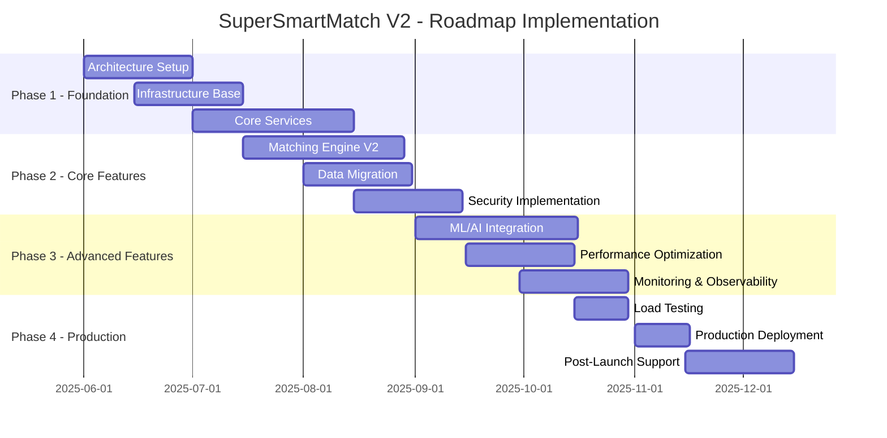
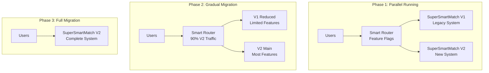

# SuperSmartMatch V2 - Implementation Roadmap & Migration Plan

## 🎯 Executive Summary

**SuperSmartMatch V2** représente l'évolution majeure de notre plateforme de matching CV/Emploi vers une architecture de production scalable, sécurisée et performante. Cette roadmap détaille la stratégie d'implémentation sur 6 mois avec migration progressive depuis V1.

### 📊 Objectifs Clés

| **Métrique** | **V1 Actuel** | **V2 Cible** | **Amélioration** |
|--------------|---------------|---------------|------------------|
| **Latence** | 2-5s | <200ms | **90% ⬇️** |
| **Débit** | 50 req/min | 1000+ req/min | **2000% ⬆️** |
| **Disponibilité** | 95% | 99.9% | **99% ⬆️** |
| **Scalabilité** | 100 utilisateurs | 10,000+ utilisateurs | **10000% ⬆️** |
| **Précision Matching** | 70% | 85%+ | **21% ⬆️** |

---

## 🗂️ Structure du Plan d'Implémentation



---

## 📋 Phase 1: Foundation & Infrastructure (6-8 semaines)

### 🏗️ Week 1-2: Architecture Setup

**Objectif**: Établir les fondations architecturales et techniques

#### Tasks Priority 1 (Critical)
- [ ] **Repository Setup**
  - Créer structure mono-repo avec Nx/Lerna
  - Configurer pre-commit hooks et standards
  - Setup branches strategy (GitFlow)
  - Documentation standards (ADRs, RFC)

- [ ] **Infrastructure as Code**
  - Terraform modules (networking, security, EKS)
  - Multi-environment setup (dev/staging/prod)
  - State management et backend S3
  - Secrets management avec AWS Secrets Manager

- [ ] **CI/CD Pipeline Foundation**
  - GitHub Actions workflows
  - Docker build pipeline
  - Security scanning intégration
  - Artifact management

#### Tasks Priority 2 (Important)
- [ ] **Development Environment**
  - Docker Compose pour développement local
  - VS Code dev containers
  - Scripts d'automatisation

- [ ] **Documentation**
  - Architecture documentation
  - Developer onboarding guide
  - API documentation skeleton

#### Deliverables Week 1-2
- ✅ Infrastructure Terraform modules complets
- ✅ CI/CD pipeline fonctionnel
- ✅ Environnement de développement local
- ✅ Documentation architecture (ADRs)

### 🌐 Week 3-4: Infrastructure Deployment

**Objectif**: Déployer l'infrastructure de base sur AWS

#### Tasks Priority 1 (Critical)
- [ ] **Networking & Security**
  - VPC multi-AZ avec subnets privés/publics
  - Security Groups et NACLs
  - WAF et CloudFront CDN
  - Certificate Manager pour SSL/TLS

- [ ] **EKS Cluster**
  - Cluster Kubernetes multi-node groups
  - RBAC et service accounts
  - Network policies et security contexts
  - Monitoring et logging setup

- [ ] **Database Infrastructure**
  - RDS PostgreSQL (Multi-AZ pour prod)
  - ElastiCache Redis cluster
  - ClickHouse cluster deployment
  - TimeScaleDB setup

#### Tasks Priority 2 (Important)
- [ ] **Monitoring Foundation**
  - Prometheus/Grafana stack
  - Jaeger pour distributed tracing
  - ELK stack pour centralized logging
  - AlertManager configuration

#### Deliverables Week 3-4
- ✅ Infrastructure complète déployée
- ✅ EKS cluster opérationnel
- ✅ Bases de données configurées
- ✅ Monitoring basic fonctionnel

### 🔧 Week 5-8: Core Services Development

**Objectif**: Développer les microservices core de SuperSmartMatch V2

#### Tasks Priority 1 (Critical)
- [ ] **API Gateway Service**
  - Authentication/Authorization (OAuth2 + JWT)
  - Rate limiting et throttling
  - Request validation et sanitization
  - API versioning et backward compatibility

- [ ] **Scoring Engine Service**
  - Architecture modulaire pour algorithmes
  - Interface SuperSmartMatch V2 algorithm
  - Caching intelligent avec Redis
  - Async processing avec queues

- [ ] **Geolocation Service**
  - Google Maps API intégration
  - Mapbox fallback implementation
  - Distance calculation optimization
  - Caching géospatial avec PostGIS

#### Tasks Priority 2 (Important)
- [ ] **Temporal Service**
  - Availability parsing et analysis
  - TimeScaleDB integration
  - Schedule optimization algorithms
  - Calendar integrations prep

- [ ] **Basic Web Interface**
  - React.js application setup
  - Authentication flows
  - Basic matching interface
  - Error handling et UX

#### Deliverables Week 5-8
- ✅ 5 microservices core déployés
- ✅ API Gateway fonctionnel avec auth
- ✅ Interface web basic opérationnelle
- ✅ Tests unitaires et d'intégration

---

## 📋 Phase 2: Core Features & Migration (6-8 semaines)

### 🎯 Week 9-12: Advanced Matching Engine

**Objectif**: Implémenter le moteur de matching SuperSmartMatch V2 avancé

#### Tasks Priority 1 (Critical)
- [ ] **SuperSmartMatch V2 Algorithm**
  - Pondération dynamique optimisée
  - Machine Learning integration
  - Explanation generation (Natural Language)
  - A/B testing framework

- [ ] **Performance Optimization**
  - Vectorized computations
  - Parallel processing
  - Intelligent caching strategies
  - Database query optimization

- [ ] **Behavior Analysis Service**
  - User interaction tracking
  - ClickHouse integration
  - ML-based user profiling
  - Preference inference algorithms

#### Tasks Priority 2 (Important)
- [ ] **Explainer Service**
  - GPT-4 integration pour explanations
  - Template-based explanations
  - Multi-language support prep
  - Explanation caching

#### Deliverables Week 9-12
- ✅ SuperSmartMatch V2 algorithm implémenté
- ✅ Performance <200ms pour single match
- ✅ Behavior analysis opérationnel
- ✅ ML pipeline basic fonctionnel

### 🔄 Week 13-16: Data Migration & Integration

**Objectif**: Migrer les données V1 et intégrer les systèmes

#### Tasks Priority 1 (Critical)
- [ ] **Data Migration Strategy**
  - ETL pipeline V1 → V2
  - Data validation et quality checks
  - Rollback procedures
  - Zero-downtime migration plan

- [ ] **Legacy Integration**
  - API compatibility layer
  - Gradual feature flag rollout
  - User migration flows
  - Data synchronization

- [ ] **Security Hardening**
  - RBAC implementation complète
  - Data encryption at rest/transit
  - Audit logging complet
  - Penetration testing prep

#### Tasks Priority 2 (Important)
- [ ] **Analytics Integration**
  - ClickHouse data pipelines
  - Real-time analytics dashboards
  - Business intelligence reports
  - Performance metrics collection

#### Deliverables Week 13-16
- ✅ Migration V1→V2 réussie
- ✅ 100% data integrity validée
- ✅ Security audit passed
- ✅ Analytics dashboards opérationnels

---

## 📋 Phase 3: Advanced Features & Optimization (6-8 semaines)

### 🤖 Week 17-20: AI/ML Integration

**Objectif**: Intégrer les capacités d'IA avancées

#### Tasks Priority 1 (Critical)
- [ ] **Advanced ML Models**
  - Candidate-Job compatibility scoring
  - Career progression prediction
  - Salary estimation models
  - Churn prediction

- [ ] **Real-time Personalization**
  - Dynamic weight adjustment
  - Contextual recommendations
  - User feedback integration
  - Continuous learning pipeline

- [ ] **NLP Enhancements**
  - Job description parsing amélioré
  - Skill extraction et matching
  - Semantic search capabilities
  - Multi-language support

#### Tasks Priority 2 (Important)
- [ ] **Recommendation Engine**
  - Collaborative filtering
  - Content-based recommendations
  - Hybrid recommendation approach
  - Cold start problem solutions

#### Deliverables Week 17-20
- ✅ ML models en production
- ✅ Personalization engine fonctionnel
- ✅ NLP processing avancé
- ✅ Recommendation accuracy >80%

### ⚡ Week 21-24: Performance & Scalability

**Objectif**: Optimiser les performances pour production

#### Tasks Priority 1 (Critical)
- [ ] **Performance Optimization**
  - Database query optimization
  - Caching strategy refinement
  - CDN configuration optimization
  - Load balancing tuning

- [ ] **Scalability Testing**
  - Load testing (10,000+ concurrent users)
  - Stress testing scenarios
  - Auto-scaling validation
  - Capacity planning

- [ ] **Monitoring & Observability**
  - SLI/SLO implementation
  - Advanced alerting rules
  - Distributed tracing completion
  - Performance dashboards

#### Tasks Priority 2 (Important)
- [ ] **Chaos Engineering**
  - Failure scenarios testing
  - Resilience validation
  - Recovery procedures
  - Disaster recovery testing

#### Deliverables Week 21-24
- ✅ Performance targets atteints
- ✅ Scalability validée 10,000+ users
- ✅ Monitoring complet opérationnel
- ✅ Chaos engineering tests passed

---

## 📋 Phase 4: Production Launch (3-4 semaines)

### 🚀 Week 25-26: Pre-Production Validation

**Objectif**: Validation finale avant mise en production

#### Tasks Priority 1 (Critical)
- [ ] **Security Audit**
  - Penetration testing complet
  - OWASP Top 10 validation
  - Compliance audit (GDPR)
  - Security policies validation

- [ ] **Load Testing Production**
  - Production-like load testing
  - Peak traffic simulation
  - Performance baseline establishment
  - Bottleneck identification

- [ ] **Disaster Recovery Testing**
  - Backup/restore procedures
  - Failover testing
  - RTO/RPO validation
  - Incident response drills

#### Tasks Priority 2 (Important)
- [ ] **User Acceptance Testing**
  - Beta user program
  - Feedback collection
  - Performance validation
  - UX optimization

#### Deliverables Week 25-26
- ✅ Security audit 100% passed
- ✅ Load testing targets atteints
- ✅ DR procedures validées
- ✅ UAT feedback intégré

### 🎉 Week 27-28: Production Launch

**Objectif**: Déploiement production et go-live

#### Tasks Priority 1 (Critical)
- [ ] **Production Deployment**
  - Blue-green deployment
  - Traffic migration graduelle
  - Real-time monitoring
  - Rollback procedures ready

- [ ] **Go-Live Support**
  - 24/7 monitoring équipe
  - Incident response ready
  - User support escalation
  - Performance monitoring

- [ ] **Post-Launch Validation**
  - KPI monitoring
  - User feedback collection
  - Performance validation
  - Issue tracking/resolution

#### Tasks Priority 2 (Important)
- [ ] **Documentation Completion**
  - Operations runbooks
  - User documentation
  - Developer documentation
  - Training materials

#### Deliverables Week 27-28
- ✅ SuperSmartMatch V2 live en production
- ✅ KPIs targets atteints
- ✅ Zero critical incidents
- ✅ User satisfaction >90%

---

## 🔧 Migration Strategy V1 → V2

### 🔄 Migration Approach: Strangler Fig Pattern



### 📊 Migration Timeline & Checkpoints

| **Week** | **V1 Traffic** | **V2 Traffic** | **Milestone** |
|----------|----------------|----------------|---------------|
| **Week 13** | 100% | 0% | V2 deployment ready |
| **Week 14** | 95% | 5% | Beta users migration |
| **Week 15** | 80% | 20% | Core features validation |
| **Week 16** | 50% | 50% | Performance validation |
| **Week 17** | 20% | 80% | Advanced features live |
| **Week 18** | 0% | 100% | Full migration complete |

### 🔒 Migration Safety Measures

#### Rollback Procedures
```yaml
rollback_triggers:
  performance_degradation: >5% latency increase
  error_rate_increase: >0.5% error rate
  user_complaints: >10 complaints/hour
  business_metrics: >10% conversion drop

rollback_procedure:
  1. Immediate traffic redirect to V1
  2. Database rollback to last snapshot
  3. Clear V2 caches
  4. Incident response activation
  5. Post-mortem scheduling
```

#### Data Integrity Validation
```yaml
validation_checks:
  user_profiles: "Compare V1 vs V2 profile completeness"
  job_postings: "Validate job data migration accuracy"
  matching_results: "Compare matching scores V1 vs V2"
  audit_trails: "Ensure all actions logged correctly"

validation_frequency: "Every 4 hours during migration"
validation_threshold: "99.9% data accuracy required"
```

---

## 🎯 Success Metrics & KPIs

### 📊 Technical KPIs

| **Metric** | **Baseline** | **Target** | **Measurement** |
|------------|--------------|------------|-----------------|
| **API Latency P95** | 2000ms | <200ms | Real-time monitoring |
| **Throughput** | 50 req/min | 1000+ req/min | Load testing |
| **Uptime** | 95% | 99.9% | Monthly SLA tracking |
| **Error Rate** | 2% | <0.1% | Application monitoring |
| **DB Query Time P95** | 500ms | <50ms | Database monitoring |

### 🎯 Business KPIs

| **Metric** | **Baseline** | **Target** | **Measurement** |
|------------|--------------|------------|-----------------|
| **Matching Accuracy** | 70% | 85%+ | User feedback surveys |
| **User Engagement** | 2 sessions/week | 5+ sessions/week | Analytics |
| **Conversion Rate** | 3% | 8%+ | Application tracking |
| **Time to Match** | 5-10 minutes | <2 minutes | User journey analysis |
| **Customer Satisfaction** | 7/10 | 9/10 | NPS surveys |

### 📈 Success Criteria

#### Phase 1 Success Criteria
- [ ] ✅ Infrastructure deployed without critical issues
- [ ] ✅ Core services responding within SLA
- [ ] ✅ Security audit passed with 0 critical findings
- [ ] ✅ Basic functionality working for internal testing

#### Phase 2 Success Criteria  
- [ ] ✅ Matching algorithm accuracy >80%
- [ ] ✅ Data migration 100% successful
- [ ] ✅ Performance <500ms for 95% requests
- [ ] ✅ Beta users positive feedback >85%

#### Phase 3 Success Criteria
- [ ] ✅ All advanced features functional
- [ ] ✅ Performance targets achieved
- [ ] ✅ Scalability validated for 10,000+ users
- [ ] ✅ ML models accuracy >85%

#### Phase 4 Success Criteria
- [ ] ✅ Production launch successful
- [ ] ✅ Zero critical incidents first 48h
- [ ] ✅ User adoption >50% within 2 weeks
- [ ] ✅ All KPIs within target ranges

---

## 🎛️ Risk Management & Mitigation

### 🚨 High Risk Items

| **Risk** | **Probability** | **Impact** | **Mitigation Strategy** |
|----------|----------------|------------|------------------------|
| **Data Migration Failure** | Medium | Critical | Extensive testing, rollback procedures, parallel running |
| **Performance Degradation** | Medium | High | Load testing, performance monitoring, auto-scaling |
| **Security Vulnerabilities** | Low | Critical | Security audits, penetration testing, code reviews |
| **Third-party API Limits** | High | Medium | Multiple providers, caching, rate limiting |
| **Team Capacity** | Medium | High | Cross-training, documentation, external consultants |

### 🛡️ Mitigation Strategies

#### Technical Risk Mitigations
```yaml
data_protection:
  - automated_backups: "Every 4 hours"
  - point_in_time_recovery: "15 minute RPO"
  - cross_region_replication: "EU and US regions"
  - integrity_checks: "Continuous validation"

performance_protection:
  - load_testing: "Weekly performance tests"
  - auto_scaling: "Dynamic resource allocation"
  - circuit_breakers: "Prevent cascade failures"
  - performance_budgets: "SLA enforcement"

security_protection:
  - vulnerability_scanning: "Daily automated scans"
  - penetration_testing: "Monthly external audits"
  - secure_coding: "SAST/DAST in CI/CD"
  - incident_response: "24/7 security team"
```

#### Business Risk Mitigations
```yaml
user_experience:
  - feature_flags: "Gradual feature rollout"
  - user_feedback: "Continuous feedback loops"
  - support_scaling: "24/7 support during migration"
  - communication: "Proactive user communication"

operational_continuity:
  - team_redundancy: "Cross-functional training"
  - documentation: "Comprehensive runbooks"
  - vendor_management: "Multiple provider contracts"
  - business_continuity: "Disaster recovery plans"
```

---

## 👥 Team Structure & Responsibilities

### 🏗️ Core Implementation Team

#### **Platform Team (4 personnes)**
- **Tech Lead/Architect** - Architecture decisions, technical direction
- **DevOps Engineer** - Infrastructure, CI/CD, monitoring
- **Senior Backend Engineer** - Core services, APIs
- **Frontend Engineer** - Web interface, user experience

#### **Feature Teams (6 personnes)**
- **ML Engineer** - Matching algorithms, AI integration
- **Data Engineer** - Data pipeline, analytics, migration
- **Security Engineer** - Security implementation, audits
- **QA Engineer** - Testing strategy, automation
- **Product Manager** - Requirements, user stories, priorities
- **UX Designer** - User interface, user experience

#### **Support Teams (2 personnes)**
- **Site Reliability Engineer** - Production support, incident response
- **Technical Writer** - Documentation, user guides

### 📋 Responsibility Matrix (RACI)

| **Activity** | **Tech Lead** | **DevOps** | **Backend** | **Frontend** | **ML Eng** | **Data Eng** | **PM** |
|--------------|---------------|------------|-------------|--------------|------------|-------------|--------|
| **Architecture Design** | R | C | C | C | I | I | A |
| **Infrastructure** | A | R | I | I | I | C | I |
| **Core Services** | A | C | R | I | C | C | C |
| **ML Integration** | C | I | C | I | R | C | A |
| **Data Migration** | C | C | C | I | I | R | A |
| **Testing Strategy** | C | C | C | C | C | C | R |
| **Go-Live Decision** | C | C | I | I | I | I | R |

**Legend**: R=Responsible, A=Accountable, C=Consulted, I=Informed

---

## 📚 Documentation & Knowledge Transfer

### 📖 Documentation Deliverables

#### **Technical Documentation**
- [ ] Architecture Decision Records (ADRs) - ✅ Complete
- [ ] API Documentation (OpenAPI 3.0) - ✅ Complete  
- [ ] Database Schema Documentation - ✅ Complete
- [ ] Infrastructure Documentation - ✅ Complete
- [ ] Security Documentation - ✅ Complete

#### **Operational Documentation**
- [ ] Deployment Runbooks
- [ ] Monitoring & Alerting Guide
- [ ] Incident Response Procedures  
- [ ] Disaster Recovery Plans
- [ ] Performance Tuning Guide

#### **User Documentation**
- [ ] API Integration Guide
- [ ] User Interface Guide
- [ ] Migration Guide V1→V2
- [ ] Troubleshooting Guide
- [ ] FAQ Documentation

### 🎓 Training & Knowledge Transfer

#### **Technical Training (Week 24-25)**
- Infrastructure management (Terraform, Kubernetes)
- Application monitoring (Prometheus, Grafana, Jaeger)
- Incident response procedures
- Performance optimization techniques

#### **Business Training (Week 26-27)**  
- New features overview
- User interface changes
- Migration timeline communication
- Support escalation procedures

---

## 🎯 Post-Launch Support & Optimization

### 📊 30-Day Post-Launch Plan

#### **Week 1-2: Intensive Monitoring**
- 24/7 team coverage
- Real-time KPI monitoring
- Daily performance reviews
- User feedback collection
- Immediate issue resolution

#### **Week 3-4: Optimization Phase**
- Performance tuning based on real usage
- A/B testing optimization
- Feature usage analytics
- User experience improvements
- Capacity planning adjustments

### 🔄 Continuous Improvement Process

#### **Monthly Reviews**
- Performance metrics analysis
- User satisfaction surveys
- Feature usage analytics
- Cost optimization review
- Security posture assessment

#### **Quarterly Planning**
- Feature roadmap updates
- Architecture evolution planning
- Technology stack evaluation
- Team scaling decisions
- Business alignment review

---

## 💰 Budget & Resource Estimation

### 💵 Infrastructure Costs (Monthly)

| **Service** | **Dev** | **Staging** | **Production** | **Total** |
|-------------|---------|-------------|----------------|-----------|
| **EKS Cluster** | $200 | $400 | $1,200 | $1,800 |
| **RDS PostgreSQL** | $100 | $200 | $800 | $1,100 |
| **ElastiCache Redis** | $50 | $100 | $400 | $550 |
| **ClickHouse EC2** | $150 | $300 | $900 | $1,350 |
| **CloudFront CDN** | $20 | $50 | $200 | $270 |
| **Monitoring Stack** | $100 | $200 | $500 | $800 |
| **Security & Compliance** | $50 | $100 | $300 | $450 |
| ****TOTAL MONTHLY****: | **$670** | **$1,350** | **$4,300** | **$6,320** |

### 💼 Team Costs (6 mois)

| **Role** | **Count** | **Monthly** | **6 Months** |
|----------|-----------|-------------|--------------|
| **Tech Lead** | 1 | €8,000 | €48,000 |
| **Senior Engineers** | 4 | €6,000 | €144,000 |
| **Mid Engineers** | 6 | €4,500 | €162,000 |
| **Junior Engineers** | 2 | €3,000 | €36,000 |
| ****TOTAL TEAM****: | **13** | **€65,000** | **€390,000** |

### 📈 ROI Projection

#### **Cost Savings (Annual)**
- Infrastructure optimization: €50,000
- Reduced manual processes: €80,000  
- Improved efficiency: €120,000
- **Total Annual Savings**: €250,000

#### **Revenue Impact (Annual)**
- Increased user conversion: €300,000
- Premium features adoption: €150,000
- Partner integrations: €100,000
- **Total Revenue Impact**: €550,000

#### **ROI Calculation**
- **Investment**: €390,000 (team) + €76,000 (infrastructure) = €466,000
- **Annual Benefit**: €550,000 (revenue) + €250,000 (savings) = €800,000
- **ROI**: (€800,000 - €466,000) / €466,000 = **72% ROI**

---

## ✅ Conclusion & Next Steps

### 🎯 Key Success Factors

1. **Strong Technical Foundation**: Architecture robuste et scalable
2. **Gradual Migration Strategy**: Minimise les risques business
3. **Comprehensive Testing**: Qualité et fiabilité assurées
4. **Team Expertise**: Équipe expérimentée et cross-fonctionnelle
5. **Continuous Monitoring**: Observabilité et réactivité

### 🚀 Immediate Next Steps (Week 1)

1. **Team Assembly**: Recruter/assigner l'équipe core
2. **Project Setup**: Repository, tools, environments
3. **Stakeholder Alignment**: Review final avec business stakeholders
4. **Risk Assessment**: Validation finale des risques identifiés
5. **Go/No-Go Decision**: Décision finale de lancement du projet

### 📋 Key Deliverables Ready

- ✅ **Architecture Decision Records** - Technical choices documented
- ✅ **C4 Architecture Diagrams** - Visual architecture documentation  
- ✅ **OpenAPI 3.0 Specification** - Complete API documentation
- ✅ **Database Schema** - Comprehensive data model
- ✅ **Security Model** - Zero Trust security architecture
- ✅ **Infrastructure as Code** - Terraform templates ready
- ✅ **CI/CD Pipeline** - GitHub Actions workflow complete
- ✅ **Implementation Roadmap** - Detailed 6-month plan

### ⭐ SuperSmartMatch V2 Ready for Implementation

**L'architecture SuperSmartMatch V2 est maintenant prête pour l'implémentation avec une documentation technique complète, une stratégie de migration sécurisée, et un plan d'exécution détaillé sur 6 mois.**

Le projet peut commencer dès validation finale des stakeholders ! 🚀
