# SuperSmartMatch V2 - Security Model & Risk Assessment

## 🛡️ Vue d'ensemble de la Sécurité

SuperSmartMatch V2 implémente un modèle de sécurité **Zero Trust** avec défense en profondeur, conformité RGPD et protection avancée contre les menaces.

### 🎯 Objectifs de Sécurité

- **Confidentialité** : Protection des données PII et sensibles
- **Intégrité** : Garantie de l'exactitude des données
- **Disponibilité** : Haute disponibilité avec résilience
- **Conformité** : RGPD, SOC2, ISO 27001
- **Auditabilité** : Traçabilité complète des actions

---

## 1. 🔐 Architecture de Sécurité

```mermaid
graph TB
    subgraph "🌐 Edge Security"
        CDN[CloudFlare CDN<br/>DDoS Protection]
        WAF[Web Application Firewall<br/>OWASP Top 10 Protection]
        RATE_LIMIT[Rate Limiting<br/>API Throttling]
    end
    
    subgraph "🚪 Identity & Access"
        IAM[Identity Provider<br/>Auth0/Okta]
        MFA[Multi-Factor Auth<br/>TOTP/SMS/Push]
        RBAC[Role-Based Access<br/>Fine-grained Permissions]
    end
    
    subgraph "🔒 Application Security"
        API_GW[API Gateway<br/>JWT Validation]
        SERVICE_MESH[Service Mesh<br/>mTLS Encryption]
        SECRET_MGT[Secret Management<br/>HashiCorp Vault]
    end
    
    subgraph "💾 Data Security"
        ENCRYPTION[Data Encryption<br/>AES-256 at Rest]
        KEY_MGT[Key Management<br/>AWS KMS/Azure KeyVault]
        BACKUP_ENC[Encrypted Backups<br/>Point-in-time Recovery]
    end
    
    subgraph "📊 Security Monitoring"
        SIEM[SIEM Platform<br/>Splunk/ELK Stack]
        THREAT_DETECTION[Threat Detection<br/>ML-based Anomalies]
        INCIDENT[Incident Response<br/>Automated Playbooks]
    end
    
    CDN --> WAF
    WAF --> RATE_LIMIT
    RATE_LIMIT --> API_GW
    
    API_GW --> IAM
    IAM --> MFA
    MFA --> RBAC
    
    API_GW --> SERVICE_MESH
    SERVICE_MESH --> SECRET_MGT
    
    SERVICE_MESH --> ENCRYPTION
    ENCRYPTION --> KEY_MGT
    KEY_MGT --> BACKUP_ENC
    
    API_GW -.-> SIEM
    SERVICE_MESH -.-> SIEM
    SIEM --> THREAT_DETECTION
    THREAT_DETECTION --> INCIDENT
```



---

## 2. 🔑 Authentification & Autorisation

### Architecture OAuth 2.0 + OIDC

```yaml
authentication_flow:
  authorization_code_flow:
    client_types:
      - spa: "Single Page Applications (React)"
      - mobile: "Mobile Apps (React Native)"
      - server: "Server-to-Server APIs"
    
    scopes:
      - "profile:read": "Lecture profil utilisateur"
      - "profile:write": "Modification profil utilisateur"
      - "jobs:read": "Lecture offres d'emploi"
      - "jobs:write": "Création/modification offres"
      - "matching:execute": "Exécution matching"
      - "analytics:read": "Lecture analytics"
      - "admin:all": "Administration complète"

  token_configuration:
    access_token:
      algorithm: "RS256"
      expiry: "15 minutes"
      issuer: "https://auth.supersmartmatch.com"
      audience: "https://api.supersmartmatch.com"
    
    refresh_token:
      expiry: "30 days"
      rotation: true
      family_tracking: true
    
    id_token:
      algorithm: "RS256"
      expiry: "1 hour"
      claims:
        - sub
        - email
        - name
        - roles
        - permissions
```

### Modèle RBAC (Role-Based Access Control)

```json
{
  "roles": {
    "candidate": {
      "description": "Candidat à la recherche d'emploi",
      "permissions": [
        "profile:read:own",
        "profile:write:own",
        "jobs:read:public",
        "matching:execute:candidate",
        "applications:read:own",
        "applications:write:own"
      ],
      "data_access": {
        "own_profile": "full",
        "other_profiles": "none",
        "job_postings": "public_only",
        "matching_results": "own_only"
      }
    },
    
    "recruiter": {
      "description": "Recruteur d'entreprise",
      "permissions": [
        "profile:read:own",
        "profile:write:own",
        "jobs:read:company",
        "jobs:write:company",
        "candidates:read:applied",
        "candidates:read:public",
        "matching:execute:recruiter",
        "analytics:read:company"
      ],
      "data_access": {
        "own_profile": "full",
        "candidate_profiles": "public_and_applied",
        "job_postings": "company_only",
        "matching_results": "company_jobs_only"
      }
    },
    
    "hr_manager": {
      "description": "Manager RH avec permissions étendues",
      "inherits": ["recruiter"],
      "additional_permissions": [
        "team:manage",
        "analytics:read:advanced",
        "reports:generate",
        "billing:read"
      ]
    },
    
    "admin": {
      "description": "Administrateur système",
      "permissions": ["*"],
      "data_access": "all",
      "restrictions": {
        "requires_mfa": true,
        "session_timeout": "30 minutes",
        "ip_whitelist": true
      }
    }
  }
}
```

### Implémentation JWT avec Claims Enrichies

```json
{
  "jwt_payload_example": {
    "iss": "https://auth.supersmartmatch.com",
    "sub": "user_01234567-89ab-cdef-1234-567890abcdef",
    "aud": "https://api.supersmartmatch.com",
    "exp": 1672531200,
    "iat": 1672530300,
    "nbf": 1672530300,
    "jti": "jwt_01234567-89ab-cdef-1234-567890abcdef",
    
    "email": "john.doe@example.com",
    "email_verified": true,
    "name": "John Doe",
    "user_type": "candidate",
    "roles": ["candidate"],
    "permissions": [
      "profile:read:own",
      "profile:write:own",
      "jobs:read:public",
      "matching:execute:candidate"
    ],
    
    "company_id": null,
    "subscription_tier": "premium",
    "rate_limit_tier": "premium",
    
    "security_context": {
      "mfa_verified": true,
      "last_password_change": "2024-12-01T10:00:00Z",
      "trusted_device": true,
      "risk_score": 0.1
    },
    
    "feature_flags": {
      "new_matching_algorithm": true,
      "advanced_analytics": true,
      "beta_features": false
    }
  }
}
```

---

## 3. 🔒 Chiffrement et Protection des Données

### Stratégie de Chiffrement

```yaml
encryption_at_rest:
  database:
    algorithm: "AES-256-GCM"
    key_management: "AWS KMS / Azure Key Vault"
    key_rotation: "30 days"
    encryption_scope:
      - candidate_profiles.personal_info
      - candidate_profiles.contact_info
      - work_experiences.salary_range
      - user_sessions.refresh_token_hash
      - audit_log.sensitive_data
  
  file_storage:
    algorithm: "AES-256-CBC"
    key_per_file: true
    metadata_encryption: true
    
  backups:
    algorithm: "AES-256-GCM"
    compressed_then_encrypted: true
    key_escrow: true

encryption_in_transit:
  external_traffic:
    protocol: "TLS 1.3"
    cipher_suites:
      - "TLS_AES_256_GCM_SHA384"
      - "TLS_CHACHA20_POLY1305_SHA256"
    hsts_enabled: true
    certificate_transparency: true
  
  internal_traffic:
    protocol: "mTLS"
    certificate_authority: "Internal CA"
    certificate_rotation: "90 days"
    cipher_suites: ["ECDHE-RSA-AES256-GCM-SHA384"]

key_management:
  hierarchy:
    - master_key: "Hardware Security Module (HSM)"
    - data_encryption_keys: "Derived from master key"
    - application_keys: "Rotated automatically"
  
  access_controls:
    - key_access_logging: "All access logged"
    - separation_of_duties: "No single person has complete access"
    - key_escrow: "Secure key recovery process"
```

### Classification des Données

```yaml
data_classification:
  public:
    description: "Données publiquement accessibles"
    examples:
      - "Offres d'emploi publiées"
      - "Profils candidats publics"
      - "Informations entreprises publiques"
    protection: "Standard"
    retention: "Selon business needs"
    
  internal:
    description: "Données internes à l'organisation"
    examples:
      - "Logs applicatifs"
      - "Métriques de performance"
      - "Configuration non-sensible"
    protection: "Access control + logging"
    retention: "2 ans"
    
  confidential:
    description: "Données sensibles métier"
    examples:
      - "Données de matching"
      - "Analytics détaillées"
      - "Informations contractuelles"
    protection: "Encryption + RBAC + audit"
    retention: "5 ans ou selon contrat"
    
  restricted:
    description: "Données personnelles identifiables"
    examples:
      - "Informations personnelles candidates"
      - "Données de contact"
      - "Historique de navigation"
    protection: "Strong encryption + strict RBAC + anonymization"
    retention: "Selon RGPD (max 3 ans)"
    gdpr_compliant: true
```

---

## 4. 🛡️ Protection Application & API

### Web Application Firewall (WAF) Rules

```yaml
waf_configuration:
  core_rule_sets:
    - owasp_crs_3.3: "OWASP Core Rule Set"
    - sql_injection: "Advanced SQL injection protection"
    - xss_protection: "Cross-site scripting prevention"
    - rfi_lfi: "Remote/Local file inclusion protection"
    
  custom_rules:
    - name: "API Rate Limiting"
      condition: "Request rate > 100/minute per IP"
      action: "Block for 10 minutes"
      
    - name: "Suspicious User Agents"
      condition: "User-Agent matches known bot patterns"
      action: "Challenge with CAPTCHA"
      
    - name: "Geolocation Filtering"
      condition: "Request from high-risk countries"
      action: "Enhanced verification"
      
    - name: "Payload Size Limit"
      condition: "Request body > 10MB"
      action: "Block"

  threat_intelligence:
    - reputation_feeds: "Threat intelligence feeds"
    - ip_blacklists: "Known malicious IPs"
    - signature_updates: "Daily updates"
    - false_positive_tuning: "ML-based optimization"

rate_limiting:
  tiers:
    anonymous:
      requests_per_minute: 10
      burst_capacity: 20
      
    authenticated:
      requests_per_minute: 100
      burst_capacity: 200
      
    premium:
      requests_per_minute: 1000
      burst_capacity: 2000
      
    enterprise:
      requests_per_minute: 10000
      burst_capacity: 20000

  algorithms:
    - token_bucket: "For burst handling"
    - sliding_window: "For consistent rate limiting"
    - distributed_counting: "Redis-based counter"
```

### API Security Headers

```yaml
security_headers:
  strict_transport_security:
    value: "max-age=31536000; includeSubDomains; preload"
    description: "Force HTTPS for 1 year"
    
  content_security_policy:
    value: |
      default-src 'self';
      script-src 'self' 'unsafe-inline' https://cdn.jsdelivr.net;
      style-src 'self' 'unsafe-inline' https://fonts.googleapis.com;
      img-src 'self' data: https:;
      connect-src 'self' https://api.supersmartmatch.com;
      font-src 'self' https://fonts.gstatic.com;
      frame-ancestors 'none';
    description: "Prevent XSS and code injection"
    
  x_frame_options:
    value: "DENY"
    description: "Prevent clickjacking"
    
  x_content_type_options:
    value: "nosniff"
    description: "Prevent MIME sniffing"
    
  referrer_policy:
    value: "strict-origin-when-cross-origin"
    description: "Control referrer information"
    
  permissions_policy:
    value: |
      camera=(), microphone=(), geolocation=(self),
      payment=(), usb=(), magnetometer=()
    description: "Control browser features"

input_validation:
  request_validation:
    - json_schema: "Validate against OpenAPI schema"
    - size_limits: "Max 10MB request size"
    - content_type: "Strict content-type validation"
    - parameter_pollution: "Detect HPP attacks"
    
  data_sanitization:
    - html_encoding: "Encode HTML special characters"
    - sql_escaping: "Parameterized queries only"
    - path_traversal: "Validate file paths"
    - command_injection: "Sanitize system commands"
```

---

## 5. 🔍 Monitoring & Détection de Menaces

### Architecture SIEM

```yaml
siem_architecture:
  log_sources:
    - application_logs: "All microservices"
    - security_events: "Authentication, authorization failures"
    - network_traffic: "Load balancer, firewall logs"
    - database_audit: "Query logs, access patterns"
    - system_metrics: "CPU, memory, disk usage"
    
  event_correlation:
    - real_time_processing: "Stream processing with Apache Kafka"
    - pattern_matching: "Sigma rules for threat detection"
    - behavioral_analysis: "ML-based anomaly detection"
    - threat_intelligence: "IOC matching"
    
  alerting_rules:
    - multiple_failed_logins:
        condition: ">5 failed logins in 5 minutes"
        severity: "HIGH"
        action: "Lock account + notify admin"
        
    - privilege_escalation:
        condition: "Role change to admin without approval"
        severity: "CRITICAL"
        action: "Immediate alert + audit trail"
        
    - data_exfiltration:
        condition: "Large data export by single user"
        severity: "HIGH"
        action: "Flag for review + rate limit"
        
    - anomalous_access:
        condition: "Access from new location/device"
        severity: "MEDIUM"
        action: "Require additional authentication"

threat_detection:
  ml_models:
    - user_behavior_anomaly:
        algorithm: "Isolation Forest"
        features: ["login_times", "access_patterns", "geographic_location"]
        training_data: "90 days rolling window"
        
    - api_abuse_detection:
        algorithm: "LSTM Neural Network"
        features: ["request_patterns", "payload_analysis", "timing_analysis"]
        update_frequency: "Daily"
        
    - insider_threat:
        algorithm: "Ensemble Methods"
        features: ["data_access_patterns", "privilege_usage", "peer_comparison"]
        sensitivity: "High"

incident_response:
  automation:
    - auto_block: "Automatic IP blocking for confirmed threats"
    - account_lockdown: "Temporary account suspension"
    - evidence_collection: "Automated log collection"
    - notification: "Real-time alerts to security team"
    
  playbooks:
    - data_breach:
        steps:
          1. "Immediate containment"
          2. "Impact assessment" 
          3. "Evidence preservation"
          4. "Regulatory notification (72h GDPR)"
          5. "Customer communication"
          6. "Remediation and recovery"
          
    - account_compromise:
        steps:
          1. "Account lockdown"
          2. "Session termination"
          3. "Password reset enforcement"
          4. "Access review"
          5. "User notification"
```

### Tableaux de Bord Sécurité

```yaml
security_dashboards:
  executive_dashboard:
    metrics:
      - security_posture_score: "Overall security health (0-100)"
      - incidents_last_30_days: "Number and severity"
      - compliance_status: "GDPR, SOC2, ISO27001 status"
      - vulnerability_count: "Critical/High/Medium/Low"
      
  operations_dashboard:
    metrics:
      - failed_login_attempts: "Real-time counter"
      - blocked_ips: "Current blacklist size"
      - api_abuse_incidents: "Rate limiting triggers"
      - certificate_expiry: "SSL/TLS certificate status"
      
  compliance_dashboard:
    metrics:
      - data_retention_compliance: "GDPR compliance status"
      - access_review_status: "Quarterly access reviews"
      - audit_log_integrity: "Log completeness and integrity"
      - encryption_coverage: "Percentage of encrypted data"
```

---

## 6. 🌍 Conformité RGPD et Protection Vie Privée

### Privacy by Design Implementation

```yaml
gdpr_compliance:
  lawful_basis:
    consent:
      - explicit_consent: "Job matching and recommendations" 
      - granular_consent: "Marketing communications"
      - consent_withdrawal: "One-click unsubscribe"
      
    legitimate_interest:
      - service_provision: "Platform functionality"
      - fraud_prevention: "Security measures"
      - analytics: "Anonymized usage statistics"
      
  data_subject_rights:
    right_of_access:
      - data_export: "Machine-readable format (JSON)"
      - response_time: "Within 30 days"
      - identity_verification: "Two-factor authentication"
      
    right_to_rectification:
      - self_service: "Profile management portal"
      - admin_interface: "Manual correction process"
      - audit_trail: "All changes logged"
      
    right_to_erasure:
      - automated_deletion: "Account deletion triggers"
      - anonymization: "Retain for analytics in anonymized form"
      - cascading_deletion: "Related data cleanup"
      
    right_to_portability:
      - data_export: "Structured format (JSON/CSV)"
      - api_access: "Programmatic data retrieval"
      - standardized_format: "Industry-standard schemas"

privacy_controls:
  data_minimization:
    - collection_limits: "Only necessary data collected"
    - retention_policies: "Automatic deletion after retention period"
    - purpose_limitation: "Data used only for stated purposes"
    
  anonymization:
    - k_anonymity: "K=5 minimum for analytics"
    - differential_privacy: "Noise injection for statistics"
    - pseudonymization: "Reversible anonymization where needed"
    
  consent_management:
    - consent_receipts: "Blockchain-based consent records"
    - granular_controls: "Feature-specific permissions"
    - consent_expiry: "Annual consent renewal"

breach_notification:
  detection:
    - automated_monitoring: "Real-time breach detection"
    - classification: "Personal data vs business data"
    - impact_assessment: "Automated DPIA triggers"
    
  notification_timeline:
    - supervisory_authority: "Within 72 hours"
    - data_subjects: "Without undue delay if high risk"
    - documentation: "Comprehensive incident report"
```

---

## 7. 🏗️ Infrastructure Security

### Container Security

```yaml
container_security:
  image_security:
    - base_images: "Distroless or minimal images"
    - vulnerability_scanning: "Trivy, Snyk integration"
    - image_signing: "Cosign for image authenticity"
    - registry_security: "Private registry with RBAC"
    
  runtime_security:
    - runtime_protection: "Falco for runtime monitoring"
    - seccomp_profiles: "Restricted system calls"
    - apparmor_profiles: "Application sandboxing"
    - network_policies: "Kubernetes NetworkPolicies"
    
  kubernetes_security:
    - pod_security_standards: "Restricted profile"
    - rbac_configuration: "Least privilege access"
    - admission_controllers: "OPA Gatekeeper policies"
    - secrets_management: "External Secrets Operator"

network_security:
  segmentation:
    - micro_segmentation: "Service-to-service isolation"
    - zero_trust_network: "Never trust, always verify"
    - network_policies: "Ingress/egress rules"
    - service_mesh: "Istio for secure communication"
    
  traffic_inspection:
    - deep_packet_inspection: "Layer 7 analysis"
    - tls_inspection: "Encrypted traffic analysis"
    - intrusion_detection: "Network-based IDS"
    - traffic_mirroring: "Security analysis"
```

---

## 8. 📋 Matrice des Risques et Mitigations

| **Risque** | **Probabilité** | **Impact** | **Score** | **Mitigation** | **Statut** |
|------------|----------------|------------|-----------|----------------|------------|
| **Data Breach** | Moyenne | Critique | 🔴 15 | Encryption + Access Controls + Monitoring | ✅ Implémenté |
| **API Abuse** | Élevée | Moyen | 🟡 12 | Rate Limiting + WAF + Bot Detection | ✅ Implémenté |
| **Insider Threat** | Faible | Critique | 🟡 9 | RBAC + Audit + Behavioral Analysis | ✅ Implémenté |
| **DDoS Attack** | Moyenne | Moyen | 🟡 8 | CDN + Auto-scaling + Traffic Shaping | ✅ Implémenté |
| **Credential Stuffing** | Élevée | Moyen | 🟡 12 | MFA + Account Lockout + Monitoring | ✅ Implémenté |
| **Supply Chain** | Faible | Élevé | 🟡 8 | Dependency Scanning + SBOMs + Signing | 🟡 En cours |
| **Cloud Misconfiguration** | Moyenne | Élevé | 🟡 12 | IaC + Config Scanning + Policies | ✅ Implémenté |
| **Ransomware** | Faible | Critique | 🟡 9 | Backups + Segmentation + EDR | ✅ Implémenté |

### Plan de Réponse aux Incidents

```yaml
incident_response_plan:
  preparation:
    - incident_team: "24/7 on-call rotation"
    - communication_plan: "Stakeholder notification matrix"
    - tools_ready: "Incident response tools and access"
    - playbooks_updated: "Quarterly playbook reviews"
    
  detection_analysis:
    - monitoring_alerts: "Automated detection systems"
    - triage_process: "Severity classification (P1-P4)"
    - initial_assessment: "Impact and scope determination"
    - evidence_preservation: "Forensic readiness"
    
  containment_eradication:
    - immediate_containment: "Isolate affected systems"
    - threat_removal: "Eliminate root cause"
    - system_hardening: "Prevent reoccurrence"
    - validation: "Confirm threat elimination"
    
  recovery:
    - service_restoration: "Gradual service recovery"
    - monitoring_enhanced: "Increased monitoring post-incident"
    - user_communication: "Transparent status updates"
    - normal_operations: "Return to BAU"
    
  lessons_learned:
    - post_incident_review: "Within 72 hours"
    - root_cause_analysis: "Technical and process failures"
    - improvement_actions: "Concrete remediation steps"
    - documentation_update: "Playbook and procedure updates"
```

---

## 9. 🧪 Tests de Sécurité et Validation

### Programme de Tests de Sécurité

```yaml
security_testing:
  static_analysis:
    tools:
      - sonarqube: "Code quality and security"
      - semgrep: "Static analysis for vulnerabilities" 
      - bandit: "Python security linter"
      - eslint_security: "JavaScript security rules"
    frequency: "Every commit"
    
  dynamic_analysis:
    tools:
      - owasp_zap: "Web application security testing"
      - burp_suite: "Professional security testing"
      - sqlmap: "SQL injection testing"
      - nmap: "Network security scanning"
    frequency: "Weekly automated + monthly manual"
    
  dependency_scanning:
    tools:
      - dependabot: "Automated dependency updates"
      - snyk: "Vulnerability database scanning"
      - owasp_dependency_check: "Known vulnerabilities"
      - renovate: "Automated security updates"
    frequency: "Daily scans"
    
  penetration_testing:
    internal: "Quarterly internal pen tests"
    external: "Annual third-party assessment"
    red_team: "Bi-annual advanced persistent threat simulation"
    bug_bounty: "Ongoing responsible disclosure program"

compliance_testing:
  automated_compliance:
    - soc2_controls: "Automated SOC2 Type II evidence collection"
    - gdpr_checks: "Data protection compliance validation"
    - pci_scanning: "If payment processing added"
    - iso27001: "Information security management validation"
    
  audit_preparation:
    - evidence_collection: "Automated compliance reports"
    - control_testing: "Regular control effectiveness testing"
    - documentation: "Up-to-date security documentation"
    - gap_analysis: "Proactive compliance gap identification"
```

---

Ce modèle de sécurité complet garantit :

✅ **Défense en profondeur** : Multiples couches de protection  
✅ **Zero Trust** : Vérification continue, jamais de confiance implicite  
✅ **Conformité RGPD** : Protection complète des données personnelles  
✅ **Détection avancée** : IA pour la détection d'anomalies et menaces  
✅ **Réponse automatisée** : Playbooks et réponses automatiques  
✅ **Audit complet** : Traçabilité et conformité réglementaire  

La prochaine étape sera de créer les templates Infrastructure as Code (Terraform) pour déployer cette architecture sécurisée !
