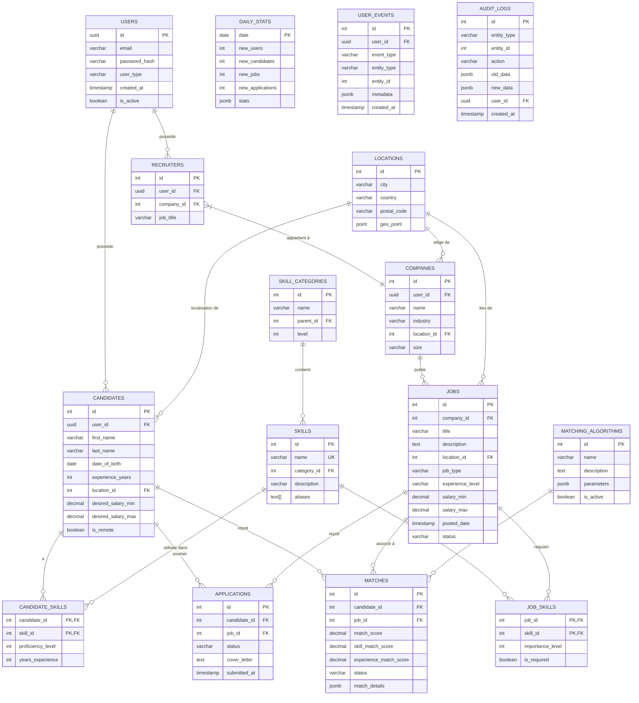

# Schéma visuel de la base de données Nexten

Ce fichier fournit une représentation visuelle des tables principales et leurs relations dans la base de données Nexten, utilisant la syntaxe Mermaid pour générer un diagramme ER (Entité-Relation).

## Description des relations principales

### Utilisateurs et profils
- Un **UTILISATEUR** peut être un candidat ou un recruteur (ou les deux)
- Un **CANDIDAT** est associé à un utilisateur et possède plusieurs compétences
- Un **RECRUTEUR** est associé à un utilisateur et appartient à une entreprise
- Une **ENTREPRISE** peut avoir plusieurs recruteurs et publier plusieurs offres d'emploi

### Compétences
- Une **COMPÉTENCE** appartient à une catégorie
- Les **CATÉGORIES DE COMPÉTENCES** peuvent être hiérarchiques (avec parent_id)
- Un **CANDIDAT** possède plusieurs compétences avec un niveau de maîtrise
- Une **OFFRE D'EMPLOI** requiert plusieurs compétences avec un niveau d'importance

### Offres d'emploi et candidatures
- Une **ENTREPRISE** publie des offres d'emploi
- Une **OFFRE D'EMPLOI** spécifie plusieurs compétences requises
- Un **CANDIDAT** peut soumettre des candidatures à plusieurs offres
- Une **CANDIDATURE** représente la relation entre un candidat et une offre

### Matching
- Un **ALGORITHME DE MATCHING** génère des correspondances entre candidats et offres
- Un **MATCH** représente la compatibilité entre un candidat et une offre avec un score

### Éléments transversaux
- **LOCALISATIONS** utilisées par les candidats, entreprises et offres d'emploi
- **AUDIT_LOGS** enregistre toutes les modifications sur les entités principales
- **DAILY_STATS** agrège les statistiques quotidiennes pour les tableaux de bord
- **USER_EVENTS** suit les interactions utilisateurs pour l'analyse comportementale

## Notes sur l'implémentation

Le diagramme ci-dessus représente les tables conceptuelles principales. Dans l'implémentation réelle:

1. Les tables sont organisées dans différents schémas (identity, profiles, jobs, matching, analytics, audit)
2. Plusieurs tables sont partitionnées pour optimiser les performances
3. De nombreux index sont définis pour accélérer les requêtes fréquentes
4. Des vues matérialisées sont utilisées pour les rapports et tableaux de bord
5. Des contraintes d'intégrité référentielle garantissent la cohérence des données
