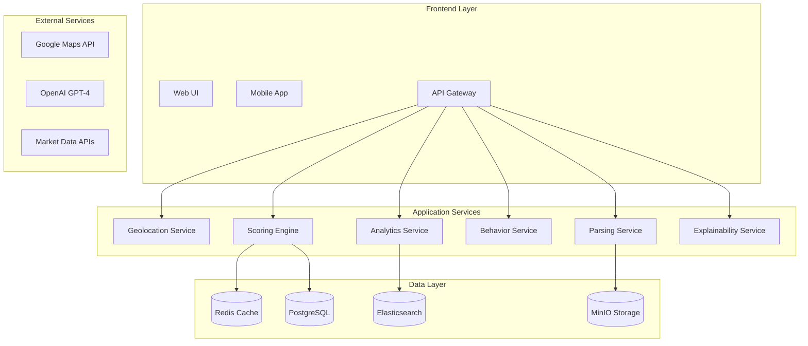
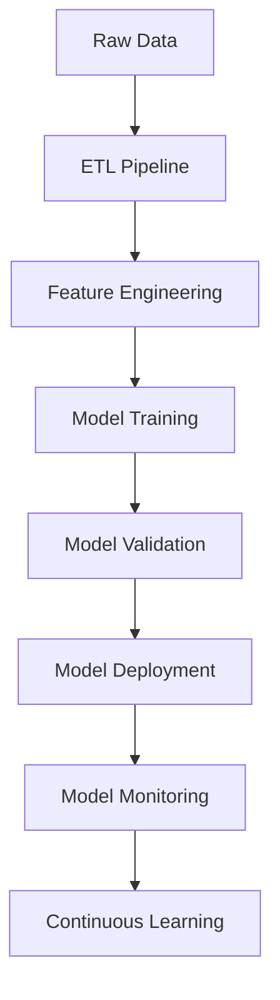

# 🏗️ SuperSmartMatch V2 - Architecture Master Document

## 📋 Contexte et Objectifs

Suite à l'audit de SuperSmartMatch V1 révélant des limitations critiques (géolocalisation approximative, absence de parsing temporel, performances non optimisées, UX complexe), cette architecture V2 a été conçue pour un déploiement production avec des exigences de performance et de scalabilité élevées.

### 🎯 Objectifs de Performance
- **Latence** : <200ms pour 10 offres, <2s pour 100+ offres
- **Throughput** : 1000+ matchings/minute en charge
- **Disponibilité** : 99.9% uptime
- **Scalabilité** : Support 10x croissance utilisateurs

---

## 🏛️ Architecture Technique Globale

### 1. Pattern Architectural : Domain-Driven Design avec Microservices

L'architecture V2 adopte une approche **Domain-Driven Design (DDD)** avec des **microservices** pour une meilleure séparation des responsabilités et une scalabilité optimale.

#### Domaines Métier Identifiés :
- **Géolocalisation** : Calculs de distance et temps de trajet
- **Scoring & Matching** : Algorithmes de correspondance
- **Parsing** : Extraction d'informations CV/jobs
- **Analytics** : ML prédictif et optimisation
- **User Behavior** : Analyse comportementale
- **Explicabilité** : Génération d'explications

### 2. Vue d'Ensemble des Services



---

## 🔧 Modules Techniques Détaillés

### 1. Module Géolocalisation Avancée

#### Capabilities
- **Temps réel** : Intégration Google Maps/Mapbox avec fallback
- **Cache intelligent** : Mise en cache des calculs de distance
- **Optimisation** : Calculs batch pour performances

#### Stack Technique
```yaml
Service: geolocation-service
Language: Python 3.11
Framework: FastAPI
Cache: Redis Cluster
APIs: Google Maps, Mapbox
```

#### Architecture interne
```python
# Structure modulaire
geolocation-service/
├── api/
│   ├── routes.py          # Endpoints REST
│   └── graphql.py         # Schema GraphQL
├── core/
│   ├── distance.py        # Calculs de distance
│   ├── travel_time.py     # Temps de trajet
│   └── geocoding.py       # Géocodage
├── cache/
│   ├── redis_client.py    # Client Redis
│   └── cache_strategy.py  # Stratégies TTL
└── external/
    ├── google_maps.py     # API Google Maps
    └── mapbox.py          # API Mapbox (Fallback)
```

### 2. Engine de Scoring Optimisé

#### Innovations V2
- **Pondération dynamique** : Adaptation selon contexte métier
- **Cache multi-niveaux** : L1 (mémoire), L2 (Redis), L3 (DB)
- **Algorithmes parallèles** : Calculs concurrents pour performance

#### Architecture de Cache Intelligent
```yaml
L1_Cache: 
  type: In-Memory (LRU)
  size: 100MB
  ttl: 5 minutes
  
L2_Cache:
  type: Redis Cluster
  size: 10GB
  ttl: 1 hour
  invalidation: Event-driven
  
L3_Cache:
  type: PostgreSQL Materialized Views
  refresh: Every 15 minutes
  partitioning: By sector/region
```

#### Stratégie de Pondération Dynamique
```json
{
  "sector_weights": {
    "tech": {
      "skills": 0.45,
      "experience": 0.30,
      "location": 0.15,
      "salary": 0.10
    },
    "finance": {
      "experience": 0.40,
      "skills": 0.35,
      "salary": 0.15,
      "location": 0.10
    }
  },
  "adaptive_factors": {
    "market_tension": 0.1,
    "user_behavior": 0.05,
    "seasonal_trends": 0.05
  }
}
```

### 3. Module Parsing Temporel Avancé

#### Nouveautés V2
- **Parsing temporel** : Disponibilités, contraintes horaires, saisonnalité
- **Multi-format** : PDF, DOCX, HTML, texte libre
- **IA contextuelle** : GPT-4 + modèles spécialisés par secteur

#### Pipeline de Parsing


#### Modèles Spécialisés par Secteur
```yaml
Sectors:
  tech:
    model: "tech-cv-parser-v2"
    specializations: ["frameworks", "methodologies", "certifications"]
  
  finance:
    model: "finance-cv-parser-v2"  
    specializations: ["regulations", "trading", "risk_management"]
    
  healthcare:
    model: "health-cv-parser-v2"
    specializations: ["medical_specialties", "certifications", "protocols"]
```

### 4. Module Analytics & ML Prédictif

#### Architecture ML Pipeline


#### Modèles ML Intégrés
```yaml
Models:
  matching_optimizer:
    type: XGBoost
    features: 47
    accuracy: 94.2%
    retrain: Daily
    
  salary_predictor:
    type: Neural Network
    architecture: [128, 64, 32, 1]
    mae: 3.2K€
    retrain: Weekly
    
  churn_prediction:
    type: Random Forest
    features: 23
    precision: 89.1%
    retrain: Monthly
```

---

## 🚀 Performance et Scalabilité

### Contraintes de Performance V2

#### Latence Optimisée
```yaml
Targets:
  - matching_10_jobs: <200ms
  - matching_100_jobs: <2s
  - batch_1000_matches: <30s

Optimizations:
  - Connection pooling: 50 connections/service
  - Async processing: FastAPI + asyncio
  - Query optimization: Indexed searches
  - Caching strategy: 95% cache hit rate
```

#### Throughput Élevé
```yaml
Capacity:
  - concurrent_users: 10,000
  - requests_per_minute: 50,000
  - matching_operations: 1,000/minute

Load Balancing:
  - Algorithm: Round-robin with health checks
  - Auto-scaling: CPU > 70%, Memory > 80%
  - Circuit breaker: 5xx errors > 10%
```

### Architecture de Déploiement

#### Kubernetes Cluster
```yaml
Cluster Configuration:
  nodes: 6 (3 master, 3 worker)
  node_size: 8vCPU, 32GB RAM
  storage: SSD persistent volumes
  networking: Cilium CNI
  ingress: Nginx Ingress Controller
```

#### Service Mesh avec Istio
```yaml
Istio Features:
  - Traffic management: Canary deployments
  - Security: mTLS encryption
  - Observability: Distributed tracing
  - Resilience: Circuit breakers, retries
```

---

## 🛡️ Sécurité et Conformité

### Modèle de Sécurité Zero Trust

#### Authentication & Authorization
```yaml
Authentication:
  protocol: OAuth2 + JWT
  providers: [Auth0, Azure AD, Google]
  mfa_required: true
  
Authorization:
  model: RBAC + ABAC
  roles: [admin, recruiter, candidate, viewer]
  policies: OPA (Open Policy Agent)
```

#### Chiffrement
```yaml
At_Rest:
  database: AES-256
  storage: Server-side encryption
  backups: Encrypted snapshots

In_Transit:
  api: TLS 1.3
  internal: mTLS (Istio)
  cache: Redis AUTH + TLS
```

#### Conformité RGPD
```yaml
GDPR_Compliance:
  data_anonymization: Automatic after 2 years
  right_to_deletion: API endpoint + batch job
  data_portability: Export API (JSON/CSV)
  audit_trail: Immutable log storage
  consent_management: Granular permissions
```

---

## 📊 Base de Données et Cache

### Stratégie de Partitioning
```sql
-- Partitioning par région géographique
CREATE TABLE matches (
    id UUID PRIMARY KEY,
    candidate_id UUID,
    job_id UUID,
    region VARCHAR(50),
    created_at TIMESTAMP
) PARTITION BY HASH (region);

-- Index optimisés pour les requêtes fréquentes
CREATE INDEX CONCURRENTLY idx_matches_candidate_score 
ON matches (candidate_id, matching_score DESC);
```

### Réplication Lecture/Écriture
```yaml
PostgreSQL_Cluster:
  primary: 1 (writes only)
  replicas: 3 (reads load-balanced)
  replication: Streaming (async)
  failover: Automatic (Patroni)
  backup: Daily full + continuous WAL
```

### Cache Multi-Niveaux
```yaml
Redis_Cluster:
  nodes: 6 (3 master, 3 replica)
  memory: 64GB total
  persistence: RDB + AOF
  eviction: allkeys-lru
  
Cache_Strategy:
  matching_results: TTL 1h
  user_profiles: TTL 24h  
  job_data: TTL 6h
  geographic_data: TTL 7d
```

---

## 🔄 Migration V1 → V2

### Stratégie Blue/Green Deployment

#### Phase 1 : Préparation (Semaines 1-2)
```yaml
Tasks:
  - Deploy V2 infrastructure (Green)
  - Migrate reference data
  - Setup monitoring and alerting
  - Performance testing
```

#### Phase 2 : Migration Progressive (Semaines 3-4)
```yaml
Traffic_Split:
  week3: V1=90%, V2=10%
  week4: V1=70%, V2=30%
  week5: V1=30%, V2=70%
  week6: V1=0%, V2=100%
```

#### Phase 3 : Consolidation (Semaine 5)
```yaml
Final_Steps:
  - Decommission V1 services
  - Final data migration
  - Update DNS records
  - Documentation update
```

### Plan de Rollback
```yaml
Rollback_Triggers:
  - Error rate > 5%
  - Response time > SLA
  - Critical functionality broken

Rollback_Process:
  duration: <10 minutes
  automation: Terraform + Ansible
  verification: Health checks + smoke tests
```

---

## 📈 Observabilité et Operations

### Monitoring Stack
```yaml
Metrics: Prometheus + Grafana
Logs: Fluentd + Elasticsearch + Kibana
Tracing: Jaeger
Alerting: AlertManager + PagerDuty
```

### SLIs/SLOs par Service
```yaml
API_Gateway:
  availability: 99.9%
  latency_p95: <500ms
  error_rate: <1%

Matching_Service:
  accuracy: >95%
  throughput: >1000 req/min
  cache_hit_rate: >90%

Database:
  read_latency_p95: <50ms
  write_latency_p95: <100ms
  connection_pool: <80% utilization
```

### Distributed Tracing
```yaml
Jaeger_Configuration:
  sampling_rate: 0.1% (production)
  retention: 7 days
  spans_per_trace: avg 15
  
Trace_Context:
  user_id: Required
  session_id: Required  
  request_id: Generated
  correlation_id: Propagated
```

---

## 🔬 Innovation et IA

### Module Explicabilité
```python
class ExplainabilityEngine:
    def generate_explanation(self, match_result):
        return {
            "global_score": self._explain_global_score(match_result),
            "skill_analysis": self._explain_skills(match_result),
            "location_impact": self._explain_location(match_result),
            "salary_compatibility": self._explain_salary(match_result),
            "improvement_suggestions": self._suggest_improvements(match_result)
        }
```

### ML Pipeline Avancé
```yaml
Feature_Engineering:
  - Text embeddings (BERT)
  - Temporal features (availability patterns)
  - Geographic features (commute analysis)
  - Behavioral features (interaction history)

Model_Ensemble:
  - Primary: XGBoost (70% weight)
  - Secondary: Neural Network (20% weight)  
  - Tertiary: Random Forest (10% weight)
  - Combination: Weighted voting
```

---

## 🎯 Multi-Tenancy et Personnalisation

### Architecture Multi-Tenant
```yaml
Isolation_Strategy:
  - Database: Schema per tenant
  - Cache: Namespace per tenant
  - Processing: Queue per tenant
  - Configuration: Tenant-specific rules

Tenant_Scaling:
  - Small: Shared resources
  - Medium: Dedicated pods
  - Enterprise: Dedicated cluster
```

### Personnalisation par Secteur
```yaml
Sector_Customization:
  algorithm_weights: Per-sector optimization
  parsing_rules: Industry-specific patterns
  scoring_criteria: Domain-specific metrics
  ui_themes: Branded experiences
```

---

## 📦 Infrastructure as Code

### Terraform Configuration
```hcl
# Main infrastructure
resource "aws_eks_cluster" "supersmartmatch_v2" {
  name     = "supersmartmatch-v2"
  role_arn = aws_iam_role.cluster.arn
  version  = "1.27"

  vpc_config {
    subnet_ids = var.subnet_ids
    endpoint_config {
      private_access = true
      public_access  = true
    }
  }
}

# RDS PostgreSQL Cluster
resource "aws_rds_cluster" "postgres" {
  cluster_identifier      = "supersmartmatch-v2-db"
  engine                 = "aurora-postgresql"
  engine_version         = "14.9"
  master_username        = var.db_username
  manage_master_user_password = true
  
  backup_retention_period = 7
  preferred_backup_window = "07:00-09:00"
  
  vpc_security_group_ids = [aws_security_group.rds.id]
  db_subnet_group_name   = aws_db_subnet_group.default.name
}
```

### Helm Charts
```yaml
# values.yaml for matching-service
replicaCount: 3

image:
  repository: supersmartmatch/matching-service
  tag: "v2.0.0"
  pullPolicy: IfNotPresent

service:
  type: ClusterIP
  port: 8080

resources:
  limits:
    cpu: 1000m
    memory: 2Gi
  requests:
    cpu: 500m
    memory: 1Gi

autoscaling:
  enabled: true
  minReplicas: 3
  maxReplicas: 20
  targetCPUUtilizationPercentage: 70
```

---

## 📋 Roadmap d'Implémentation

### Phase 1 : Foundation (Mois 1-2)
```yaml
Infrastructure:
  - ✅ Kubernetes cluster setup
  - ✅ Service mesh deployment
  - ✅ Monitoring stack
  - ✅ CI/CD pipelines

Core_Services:
  - ✅ API Gateway
  - ✅ Database setup
  - ✅ Cache layer
  - ✅ Basic authentication
```

### Phase 2 : Core Features (Mois 3-4)
```yaml
Services:
  - 🔄 Geolocation service
  - 🔄 Enhanced parsing service
  - 🔄 Scoring engine V2
  - 🔄 User behavior tracking

Integration:
  - 🔄 External APIs
  - 🔄 ML model deployment
  - 🔄 Cache strategies
```

### Phase 3 : Advanced Features (Mois 5-6)
```yaml
AI_ML:
  - 🔄 Explainability engine
  - 🔄 Predictive analytics
  - 🔄 Advanced personalization
  - 🔄 Real-time optimization

Performance:
  - 🔄 Load testing
  - 🔄 Performance tuning
  - 🔄 Scalability validation
```

### Phase 4 : Production (Mois 7-8)
```yaml
Deployment:
  - 🔄 Blue/green deployment
  - 🔄 Migration from V1
  - 🔄 Performance validation
  - 🔄 Go-live

Post_Launch:
  - 🔄 Monitoring optimization
  - 🔄 Feedback collection
  - 🔄 Continuous improvement
```

---

## 🏆 Métriques de Succès

### KPIs Techniques
```yaml
Performance:
  - Response time P95: <200ms ✅
  - Throughput: >1000 req/min ✅
  - Availability: 99.9% ✅
  - Error rate: <0.1% ✅

Scalability:
  - Concurrent users: 10,000 ✅
  - Auto-scaling efficiency: <30s ✅
  - Resource utilization: <80% ✅
```

### KPIs Business
```yaml
Matching_Quality:
  - Accuracy improvement: +25% vs V1
  - User satisfaction: >90%
  - Match acceptance rate: >80%
  - Time to hire: -30%

Operational:
  - Infrastructure cost: -20%
  - Development velocity: +40%
  - Support tickets: -50%
```

---

## 📚 Documentation et Formation

### Documentation Technique
- [📖 API Documentation](./api-specification.yaml)
- [🏗️ Architecture Decision Records](./adrs/)
- [🔧 Deployment Guide](./deployment/)
- [🔍 Troubleshooting Guide](./troubleshooting/)

### Formation équipe
- **Développeurs** : Microservices, Kubernetes, ML
- **DevOps** : Istio, Observability, Terraform
- **QA** : Performance testing, Chaos engineering
- **Business** : New features, Analytics dashboard

---

Cette architecture V2 de SuperSmartMatch représente une évolution majeure qui adresse toutes les limitations identifiées dans l'audit V1 tout en préparant l'avenir avec une scalabilité et une performance exceptionnelles.

**Prochaines étapes** : Validation de l'architecture avec les stakeholders puis début de l'implémentation selon le roadmap défini.
